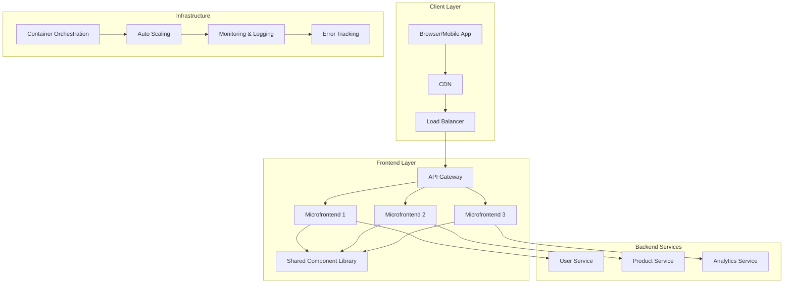
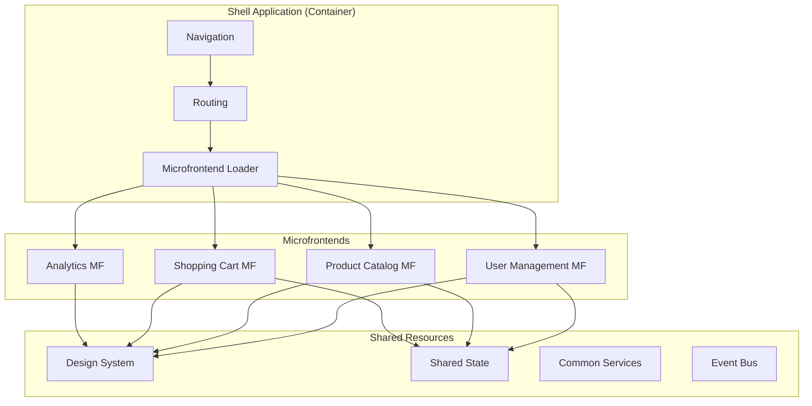

# Frontend Architecture / Kiến trúc Frontend

*Comprehensive guide to frontend system architecture design for senior-level interviews at Big Tech companies.*  
*Hướng dẫn toàn diện về thiết kế kiến trúc hệ thống frontend cho phỏng vấn cấp senior tại các công ty Big Tech.*

## Overview / Tổng quan

### Architecture Patterns / Mô hình kiến trúc
- **Monolith vs Microfrontend / Monolith vs Microfrontend**: Single application vs distributed frontend components / Ứng dụng đơn vs các thành phần frontend phân tán
- **SSR, CSR, SSG, ISG**: Server-side rendering strategies / Các chiến lược render phía server
- **CDN, Caching, Performance / CDN, Caching, Hiệu suất**: Content delivery and optimization / Phân phối nội dung và tối ưu hóa

## Interview Questions & Answers / Câu hỏi phỏng vấn và câu trả lời

### Q1: How do you design a scalable frontend system? / Bạn thiết kế hệ thống frontend có thể mở rộng như thế nào?

#### English Answer:
I approach frontend system design with a focus on scalability, maintainability, and performance:

**1. Architecture Decision Framework:**
```
Assess Requirements:
- Expected user load and growth patterns
- Team size and development velocity
- Performance requirements and constraints
- Business requirements and timeline

Choose Architecture Pattern:
- Monolithic: Single team, simple deployment, rapid prototyping
- Microfrontend: Multiple teams, independent deployments, complex domain
- Hybrid: Start monolithic, evolve to microfrontend as needed
```

**2. Scalable Frontend Architecture Components:**



**3. Key Design Principles:**

**Horizontal Scalability:**
- Component-based architecture with clear boundaries
- Stateless components that can scale independently
- Microservices integration with proper API design
- Caching strategies at multiple levels

**Performance Optimization:**
- Code splitting and lazy loading for reduced initial bundle size
- Server-side rendering for critical paths
- Progressive Web App features (service workers, offline support)
- Resource optimization (images, fonts, third-party scripts)

**Development Scalability:**
- Modular architecture enabling team independence
- Shared design system and component library
- Standardized development practices and CI/CD pipelines
- Documentation and onboarding processes

**4. Implementation Strategy:**
```javascript
// Example: Modular architecture with micro-frontends
const MicrofrontendRegistry = {
  'user-profile': {
    url: 'https://user-profile.company.com',
    fallback: () => import('./fallbacks/UserProfile'),
    dependencies: ['shared-components', 'user-service']
  },
  'product-catalog': {
    url: 'https://products.company.com',
    fallback: () => import('./fallbacks/ProductCatalog'),
    dependencies: ['shared-components', 'product-service']
  }
};

// Dynamic loading with error boundaries
async function loadMicrofrontend(name) {
  try {
    const config = MicrofrontendRegistry[name];
    const module = await System.import(config.url);
    return module.default;
  } catch (error) {
    console.error(`Failed to load ${name}:`, error);
    return config.fallback();
  }
}
```

**5. Monitoring and Observability:**
- Real User Monitoring (RUM) for performance metrics
- Error tracking and alerting systems
- A/B testing infrastructure for feature validation
- Analytics for user behavior and system usage

#### Câu trả lời (Tiếng Việt):
Tôi tiếp cận thiết kế hệ thống frontend với trọng tâm là khả năng mở rộng, bảo trì và hiệu suất:

**1. Khung quyết định kiến trúc:**
- Đánh giá yêu cầu: Tải người dùng dự kiến, kích thước nhóm, yêu cầu hiệu suất
- Chọn mô hình kiến trúc: Monolithic cho nhóm đơn, Microfrontend cho nhiều nhóm
- Hybrid: Bắt đầu monolithic, phát triển thành microfrontend khi cần

**2. Các thành phần kiến trúc Frontend có thể mở rộng:**
- Tầng client: Browser/Mobile App → CDN → Load Balancer
- Tầng frontend: API Gateway → Microfrontends → Shared Components
- Backend services: User Service, Product Service, Analytics Service

**3. Nguyên tắc thiết kế chính:**
- Khả năng mở rộng theo chiều ngang: Kiến trúc dựa trên component
- Tối ưu hiệu suất: Code splitting, lazy loading, SSR
- Khả năng mở rộng phát triển: Kiến trúc modular, design system chung

### Q2: What is SSR and when do you use it? / SSR là gì và khi nào bạn sử dụng nó?

#### English Answer:
Server-Side Rendering (SSR) is a technique where HTML content is generated on the server and sent to the client, rather than relying on client-side JavaScript to build the page.

**1. SSR vs CSR vs SSG vs ISR Comparison:**

| **Approach** | **When to Use** | **Pros** | **Cons** |
|--------------|-----------------|----------|----------|
| **SSR** | Dynamic content, SEO critical, fast initial load | SEO-friendly, Fast FCP, Works without JS | Server load, Complex caching, Higher latency |
| **CSR** | Highly interactive apps, authenticated content | Rich interactions, Offline capability, Simple deployment | Poor SEO, Slow FCP, JS dependency |
| **SSG** | Static content, blogs, marketing sites | Excellent performance, SEO, Simple scaling | Build time increases, Less dynamic |
| **ISR** | E-commerce, news sites, frequent updates | Best of SSG + SSR, Scalable, Fresh content | Complex setup, Caching complexity |

**2. Implementation Example with Next.js:**

```javascript
// SSR - Server-Side Rendering
export async function getServerSideProps(context) {
  // This runs on every request
  const { userId } = context.params;
  const userData = await fetchUserData(userId);
  
  return {
    props: {
      user: userData,
      renderTime: new Date().toISOString()
    }
  };
}

function UserProfile({ user, renderTime }) {
  return (
    <div>
      <h1>{user.name}'s Profile</h1>
      <p>Rendered at: {renderTime}</p>
      <div>Dynamic content: {user.posts.length} posts</div>
    </div>
  );
}

// SSG - Static Site Generation
export async function getStaticProps() {
  // This runs at build time
  const posts = await fetchAllPosts();
  
  return {
    props: { posts },
    revalidate: 3600 // ISR: revalidate every hour
  };
}

export async function getStaticPaths() {
  const posts = await fetchAllPosts();
  const paths = posts.map(post => ({
    params: { slug: post.slug }
  }));
  
  return {
    paths,
    fallback: 'blocking' // Enable ISR for new paths
  };
}

// Hybrid approach with selective hydration
function ProductPage({ product, reviews }) {
  return (
    <div>
      {/* Critical content rendered on server */}
      <ProductInfo product={product} />
      
      {/* Interactive components hydrated on client */}
      <Suspense fallback={<ReviewsSkeleton />}>
        <ReviewsSection productId={product.id} initialReviews={reviews} />
      </Suspense>
      
      {/* Non-critical components loaded later */}
      <LazyComponent>
        <RecommendedProducts category={product.category} />
      </LazyComponent>
    </div>
  );
}
```

**3. Decision Framework for Rendering Strategy:**

```javascript
function chooseRenderingStrategy(requirements) {
  const {
    seoRequired,
    contentDynamic,
    userInteractivity,
    updateFrequency,
    serverCapacity,
    buildTime
  } = requirements;
  
  if (seoRequired && contentDynamic === 'high') {
    return 'SSR'; // Real-time SEO content
  }
  
  if (seoRequired && updateFrequency === 'medium') {
    return 'ISR'; // Best of both worlds
  }
  
  if (seoRequired && contentDynamic === 'low') {
    return 'SSG'; // Static content with SEO
  }
  
  if (userInteractivity === 'high' && !seoRequired) {
    return 'CSR'; // Rich client interactions
  }
  
  return 'Hybrid'; // Mix strategies based on page needs
}
```

**4. Performance Optimization for SSR:**

```javascript
// Streaming SSR for faster Time to First Byte
import { renderToReadableStream } from 'react-dom/server';

async function handleRequest(request) {
  const stream = await renderToReadableStream(
    <App />,
    {
      bootstrapScripts: ['/client.js'],
      onError: (error) => {
        console.error('Render error:', error);
      }
    }
  );
  
  return new Response(stream, {
    headers: {
      'Content-Type': 'text/html',
      'Cache-Control': 'public, s-maxage=60, stale-while-revalidate=86400'
    }
  });
}

// Selective hydration for performance
function App() {
  return (
    <>
      {/* Static content - no hydration needed */}
      <Header />
      <Navigation />
      
      {/* Interactive content - hydrate immediately */}
      <Suspense fallback={<LoadingSpinner />}>
        <UserDashboard />
      </Suspense>
      
      {/* Non-critical content - lazy hydration */}
      <LazyHydrate when={userScrolled}>
        <RecommendationsWidget />
      </LazyHydrate>
    </>
  );
}
```

#### Câu trả lời (Tiếng Việt):
Server-Side Rendering (SSR) là kỹ thuật mà nội dung HTML được tạo trên server và gửi đến client, thay vì dựa vào JavaScript phía client để xây dựng trang.

**1. So sánh SSR vs CSR vs SSG vs ISR:**
- SSR: Nội dung động, SEO quan trọng, tải ban đầu nhanh
- CSR: Ứng dụng tương tác cao, nội dung đã xác thực
- SSG: Nội dung tĩnh, blog, trang marketing
- ISR: E-commerce, trang tin tức, cập nhật thường xuyên

**2. Khung quyết định cho chiến lược rendering:**
- SEO cần thiết + nội dung động cao → SSR
- SEO cần thiết + tần suất cập nhật trung bình → ISR
- SEO cần thiết + nội dung động thấp → SSG
- Tương tác người dùng cao + không cần SEO → CSR

### Q3: How do you implement microfrontend architecture? / Bạn triển khai kiến trúc microfrontend như thế nào?

#### English Answer:
Microfrontend architecture enables multiple teams to work independently on different parts of a frontend application while maintaining a cohesive user experience.

**1. Microfrontend Implementation Approaches:**



**2. Implementation Patterns:**

**Module Federation (Webpack 5):**
```javascript
// Shell application webpack config
const ModuleFederationPlugin = require('@module-federation/webpack');

module.exports = {
  plugins: [
    new ModuleFederationPlugin({
      name: 'shell',
      remotes: {
        userProfile: 'userProfile@http://localhost:3001/remoteEntry.js',
        productCatalog: 'productCatalog@http://localhost:3002/remoteEntry.js',
        shoppingCart: 'shoppingCart@http://localhost:3003/remoteEntry.js'
      },
      shared: {
        react: { singleton: true },
        'react-dom': { singleton: true },
        '@company/design-system': { singleton: true }
      }
    })
  ]
};

// Shell application router
import { Suspense } from 'react';
import { Routes, Route } from 'react-router-dom';

const UserProfile = lazy(() => import('userProfile/UserProfile'));
const ProductCatalog = lazy(() => import('productCatalog/ProductCatalog'));
const ShoppingCart = lazy(() => import('shoppingCart/ShoppingCart'));

function App() {
  return (
    <div className="app">
      <Navigation />
      <Suspense fallback={<LoadingSpinner />}>
        <Routes>
          <Route path="/profile/*" element={<UserProfile />} />
          <Route path="/products/*" element={<ProductCatalog />} />
          <Route path="/cart/*" element={<ShoppingCart />} />
        </Routes>
      </Suspense>
    </div>
  );
}
```

**3. Communication Between Microfrontends:**

```javascript
// Event-driven communication system
class MicrofrontendEventBus {
  constructor() {
    this.events = {};
  }
  
  subscribe(event, callback) {
    if (!this.events[event]) {
      this.events[event] = [];
    }
    this.events[event].push(callback);
    
    // Return unsubscribe function
    return () => {
      this.events[event] = this.events[event].filter(cb => cb !== callback);
    };
  }
  
  publish(event, data) {
    if (this.events[event]) {
      this.events[event].forEach(callback => callback(data));
    }
  }
}

// Global event bus instance
window.microfrontendEventBus = new MicrofrontendEventBus();

// Usage in microfrontends
// Shopping Cart MF - publishes cart updates
function ShoppingCart() {
  const addToCart = (product) => {
    // Add product logic...
    window.microfrontendEventBus.publish('cart:item-added', {
      product,
      cartTotal: newTotal,
      timestamp: Date.now()
    });
  };
  
  return <CartComponent onAddToCart={addToCart} />;
}

// Navigation MF - subscribes to cart updates
function Navigation() {
  const [cartCount, setCartCount] = useState(0);
  
  useEffect(() => {
    const unsubscribe = window.microfrontendEventBus.subscribe(
      'cart:item-added',
      (data) => {
        setCartCount(prev => prev + 1);
      }
    );
    
    return unsubscribe;
  }, []);
  
  return (
    <nav>
      <CartIcon count={cartCount} />
    </nav>
  );
}
```

**4. Shared State Management:**

```javascript
// Shared state with Zustand
import { create } from 'zustand';
import { subscribeWithSelector } from 'zustand/middleware';

// Global store accessible by all microfrontends
const useGlobalStore = create(
  subscribeWithSelector((set, get) => ({
    user: null,
    cart: { items: [], total: 0 },
    theme: 'light',
    
    setUser: (user) => set({ user }),
    addToCart: (item) => set((state) => ({
      cart: {
        items: [...state.cart.items, item],
        total: state.cart.total + item.price
      }
    })),
    setTheme: (theme) => set({ theme })
  }))
);

// Make store globally available
window.globalStore = useGlobalStore;

// Usage in microfrontends
function UserProfile() {
  const user = window.globalStore(state => state.user);
  const setUser = window.globalStore(state => state.setUser);
  
  return <ProfileComponent user={user} onUpdate={setUser} />;
}
```

**5. Deployment and DevOps Strategy:**

```yaml
# CI/CD Pipeline for Microfrontends
name: Microfrontend Deployment

on:
  push:
    paths:
      - 'microfrontends/user-profile/**'
      - 'microfrontends/product-catalog/**'
      - 'microfrontends/shopping-cart/**'

jobs:
  detect-changes:
    runs-on: ubuntu-latest
    outputs:
      user-profile: ${{ steps.changes.outputs.user-profile }}
      product-catalog: ${{ steps.changes.outputs.product-catalog }}
      shopping-cart: ${{ steps.changes.outputs.shopping-cart }}
    
  deploy-user-profile:
    needs: detect-changes
    if: needs.detect-changes.outputs.user-profile == 'true'
    runs-on: ubuntu-latest
    steps:
      - name: Build and Deploy User Profile MF
        run: |
          npm run build:user-profile
          aws s3 sync ./dist s3://user-profile-mf-bucket
          aws cloudfront create-invalidation --distribution-id $CLOUDFRONT_ID
  
  integration-tests:
    needs: [deploy-user-profile, deploy-product-catalog, deploy-shopping-cart]
    runs-on: ubuntu-latest
    steps:
      - name: Run Cross-MF Integration Tests
        run: npm run test:integration
```

#### Câu trả lời (Tiếng Việt):
Kiến trúc microfrontend cho phép nhiều nhóm làm việc độc lập trên các phần khác nhau của ứng dụng frontend trong khi duy trì trải nghiệm người dùng thống nhất.

**1. Các cách tiếp cận triển khai Microfrontend:**
- Module Federation (Webpack 5): Chia sẻ dependencies và load động
- Shell Application: Container chính điều phối các microfrontend
- Event Bus: Giao tiếp giữa các microfrontend qua events

**2. Mô hình giao tiếp:**
- Event-driven: Publish/Subscribe pattern cho loose coupling
- Shared State: Store toàn cục accessible bởi tất cả microfrontend
- API Gateway: Centralized communication với backend services

**3. Chiến lược triển khai:**
- Independent deployment: Mỗi microfrontend deploy độc lập
- Integration testing: Test cross-MF interactions
- Monitoring: Track performance và errors của từng microfrontend

### Q4: How do you optimize frontend performance at scale? / Bạn tối ưu hiệu suất frontend ở quy mô lớn như thế nào?

#### English Answer:
Performance optimization at scale requires a systematic approach across multiple dimensions:

**1. Bundle Optimization Strategy:**

```javascript
// Advanced code splitting with React.lazy and Suspense
const LazyRoutes = {
  Dashboard: lazy(() => 
    import(/* webpackChunkName: "dashboard" */ './pages/Dashboard')
  ),
  UserProfile: lazy(() => 
    import(/* webpackChunkName: "user-profile" */ './pages/UserProfile')
  ),
  Analytics: lazy(() => 
    import(/* webpackChunkName: "analytics" */ './pages/Analytics')
  )
};

// Route-based splitting with preloading
function App() {
  return (
    <Router>
      <Suspense fallback={<GlobalLoader />}>
        <Routes>
          <Route 
            path="/dashboard" 
            element={<LazyRoutes.Dashboard />}
            onEnter={() => {
              // Preload related routes
              import('./pages/UserProfile');
              import('./pages/Settings');
            }}
          />
        </Routes>
      </Suspense>
    </Router>
  );
}

// Webpack optimization configuration
module.exports = {
  optimization: {
    splitChunks: {
      chunks: 'all',
      cacheGroups: {
        vendor: {
          test: /[\\/]node_modules[\\/]/,
          name: 'vendors',
          chunks: 'all',
          maxSize: 250000 // 250KB max chunk size
        },
        common: {
          name: 'common',
          minChunks: 2,
          chunks: 'all',
          enforce: true
        }
      }
    }
  }
};
```

**2. Resource Loading Optimization:**

```javascript
// Critical resource preloading strategy
function ResourcePreloader() {
  useEffect(() => {
    // Preload critical resources
    const criticalResources = [
      '/api/user/profile',
      '/api/dashboard/summary',
      '/static/critical-icons.svg'
    ];
    
    criticalResources.forEach(resource => {
      const link = document.createElement('link');
      link.rel = 'preload';
      link.href = resource;
      link.as = resource.includes('/api/') ? 'fetch' : 'image';
      document.head.appendChild(link);
    });
    
    // Prefetch likely next resources
    const prefetchResources = [
      '/static/secondary-images.webp',
      '/api/user/preferences'
    ];
    
    setTimeout(() => {
      prefetchResources.forEach(resource => {
        const link = document.createElement('link');
        link.rel = 'prefetch';
        link.href = resource;
        document.head.appendChild(link);
      });
    }, 2000);
  }, []);
  
  return null;
}

// Progressive image loading with intersection observer
function OptimizedImage({ src, alt, className }) {
  const [isLoaded, setIsLoaded] = useState(false);
  const [isInView, setIsInView] = useState(false);
  const imgRef = useRef();
  
  useEffect(() => {
    const observer = new IntersectionObserver(
      ([entry]) => {
        if (entry.isIntersecting) {
          setIsInView(true);
          observer.disconnect();
        }
      },
      { threshold: 0.1 }
    );
    
    if (imgRef.current) {
      observer.observe(imgRef.current);
    }
    
    return () => observer.disconnect();
  }, []);
  
  return (
    <div ref={imgRef} className={className}>
      {isInView && (
        <>
           setIsLoaded(true)}
            style={{ 
              opacity: isLoaded ? 1 : 0,
              transition: 'opacity 0.3s ease'
            }}
          />
          {!isLoaded && <ImageSkeleton />}
        </>
      )}
    </div>
  );
}
```

**3. Caching Strategy Implementation:**

```javascript
// Multi-level caching strategy
class CacheManager {
  constructor() {
    this.memoryCache = new Map();
    this.serviceWorkerCache = 'api-cache-v1';
    this.maxMemoryCacheSize = 100;
  }
  
  async get(key, options = {}) {
    // Level 1: Memory cache (fastest)
    if (this.memoryCache.has(key)) {
      const { data, timestamp, ttl } = this.memoryCache.get(key);
      if (Date.now() - timestamp < ttl) {
        return data;
      }
      this.memoryCache.delete(key);
    }
    
    // Level 2: Service Worker cache
    if ('serviceWorker' in navigator) {
      const cache = await caches.open(this.serviceWorkerCache);
      const response = await cache.match(key);
      if (response && !this.isStale(response, options.ttl)) {
        const data = await response.json();
        this.setMemoryCache(key, data, options.ttl);
        return data;
      }
    }
    
    // Level 3: Network request with cache update
    const data = await this.fetchFromNetwork(key);
    this.setMultiLevelCache(key, data, options.ttl);
    return data;
  }
  
  async setMultiLevelCache(key, data, ttl = 300000) {
    // Update memory cache
    this.setMemoryCache(key, data, ttl);
    
    // Update service worker cache
    if ('serviceWorker' in navigator) {
      const cache = await caches.open(this.serviceWorkerCache);
      const response = new Response(JSON.stringify(data), {
        headers: {
          'Content-Type': 'application/json',
          'sw-cache-timestamp': Date.now().toString()
        }
      });
      await cache.put(key, response);
    }
  }
  
  setMemoryCache(key, data, ttl) {
    // Implement LRU eviction
    if (this.memoryCache.size >= this.maxMemoryCacheSize) {
      const firstKey = this.memoryCache.keys().next().value;
      this.memoryCache.delete(firstKey);
    }
    
    this.memoryCache.set(key, {
      data,
      timestamp: Date.now(),
      ttl
    });
  }
}

// Usage in React components
const cacheManager = new CacheManager();

function useApiData(endpoint, options = {}) {
  const [data, setData] = useState(null);
  const [loading, setLoading] = useState(true);
  const [error, setError] = useState(null);
  
  useEffect(() => {
    let cancelled = false;
    
    async function fetchData() {
      try {
        setLoading(true);
        const result = await cacheManager.get(endpoint, {
          ttl: options.ttl || 300000 // 5 minutes default
        });
        
        if (!cancelled) {
          setData(result);
          setError(null);
        }
      } catch (err) {
        if (!cancelled) {
          setError(err);
        }
      } finally {
        if (!cancelled) {
          setLoading(false);
        }
      }
    }
    
    fetchData();
    
    return () => {
      cancelled = true;
    };
  }, [endpoint, options.ttl]);
  
  return { data, loading, error };
}
```

**4. Runtime Performance Monitoring:**

```javascript
// Performance monitoring and optimization
class PerformanceMonitor {
  constructor() {
    this.metrics = new Map();
    this.thresholds = {
      renderTime: 16, // 60fps target
      apiResponseTime: 200,
      bundleSize: 250000 // 250KB
    };
  }
  
  measureRenderPerformance(componentName, renderFn) {
    return function WrappedComponent(props) {
      const startTime = performance.now();
      
      useEffect(() => {
        const endTime = performance.now();
        const renderTime = endTime - startTime;
        
        this.recordMetric('renderTime', componentName, renderTime);
        
        if (renderTime > this.thresholds.renderTime) {
          console.warn(
            `Slow render detected: ${componentName} took ${renderTime}ms`
          );
          
          // Send to monitoring service
          this.sendMetric({
            type: 'slow-render',
            component: componentName,
            renderTime,
            props: Object.keys(props)
          });
        }
      });
      
      return renderFn(props);
    }.bind(this);
  }
  
  measureApiPerformance(url, options) {
    const startTime = performance.now();
    
    return fetch(url, options)
      .then(response => {
        const endTime = performance.now();
        const responseTime = endTime - startTime;
        
        this.recordMetric('apiResponseTime', url, responseTime);
        
        if (responseTime > this.thresholds.apiResponseTime) {
          this.sendMetric({
            type: 'slow-api',
            url,
            responseTime,
            status: response.status
          });
        }
        
        return response;
      });
  }
  
  recordMetric(type, identifier, value) {
    if (!this.metrics.has(type)) {
      this.metrics.set(type, new Map());
    }
    
    const typeMetrics = this.metrics.get(type);
    if (!typeMetrics.has(identifier)) {
      typeMetrics.set(identifier, []);
    }
    
    typeMetrics.get(identifier).push({
      value,
      timestamp: Date.now()
    });
    
    // Keep only last 100 measurements
    const measurements = typeMetrics.get(identifier);
    if (measurements.length > 100) {
      measurements.shift();
    }
  }
  
  getPerformanceReport() {
    const report = {};
    
    for (const [type, identifierMap] of this.metrics.entries()) {
      report[type] = {};
      
      for (const [identifier, measurements] of identifierMap.entries()) {
        const values = measurements.map(m => m.value);
        report[type][identifier] = {
          average: values.reduce((a, b) => a + b, 0) / values.length,
          min: Math.min(...values),
          max: Math.max(...values),
          count: values.length
        };
      }
    }
    
    return report;
  }
}

// Global performance monitor instance
const performanceMonitor = new PerformanceMonitor();

// Usage example
const OptimizedComponent = performanceMonitor.measureRenderPerformance(
  'UserDashboard',
  function UserDashboard({ userId }) {
    const { data, loading } = useApiData(`/api/users/${userId}`);
    
    if (loading) return <LoadingSkeleton />;
    
    return (
      <div>
        <UserProfile user={data} />
        <UserAnalytics userId={userId} />
      </div>
    );
  }
);
```

#### Câu trả lời (Tiếng Việt):
Tối ưu hiệu suất ở quy mô lớn đòi hỏi cách tiếp cận có hệ thống trên nhiều khía cạnh:

**1. Chiến lược tối ưu Bundle:**
- Code splitting: Tách code theo route và component
- Lazy loading: Load component khi cần thiết
- Bundle analysis: Phân tích và giảm kích thước bundle

**2. Tối ưu tải tài nguyên:**
- Resource preloading: Preload tài nguyên quan trọng
- Progressive loading: Load hình ảnh khi scroll đến
- Critical path optimization: Ưu tiên tài nguyên quan trọng

**3. Chiến lược Caching:**
- Multi-level cache: Memory cache + Service Worker + Network
- Cache invalidation: Quản lý vòng đời cache hiệu quả
- API response caching: Cache kết quả API calls

**4. Monitoring hiệu suất:**
- Real-time metrics: Theo dõi render time, API response time
- Performance budgets: Đặt ngưỡng hiệu suất và cảnh báo
- Automated optimization: Tự động tối ưu dựa trên metrics

---

## System Design Best Practices / Thực hành tốt nhất về System Design

### English Best Practices:
1. **Start with Requirements**: Clearly define functional and non-functional requirements
2. **Design for Scale**: Consider growth patterns and scaling bottlenecks
3. **Plan for Failure**: Implement error boundaries, fallbacks, and recovery mechanisms
4. **Monitor Everything**: Comprehensive observability and alerting
5. **Iterate and Improve**: Continuous optimization based on real-world usage

### Thực hành tốt nhất (Tiếng Việt):
1. **Bắt đầu với yêu cầu**: Định nghĩa rõ ràng yêu cầu chức năng và phi chức năng
2. **Thiết kế cho quy mô**: Cân nhắc mô hình tăng trưởng và điểm nghẽn mở rộng
3. **Lập kế hoạch cho thất bại**: Triển khai error boundary, fallback và cơ chế phục hồi
4. **Giám sát tất cả**: Khả năng quan sát toàn diện và cảnh báo
5. **Lặp lại và cải thiện**: Tối ưu liên tục dựa trên việc sử dụng thực tế
