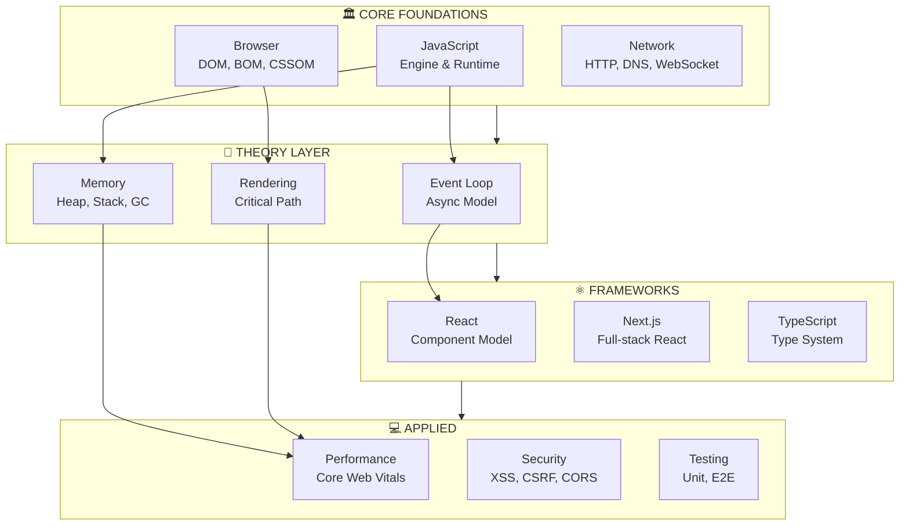
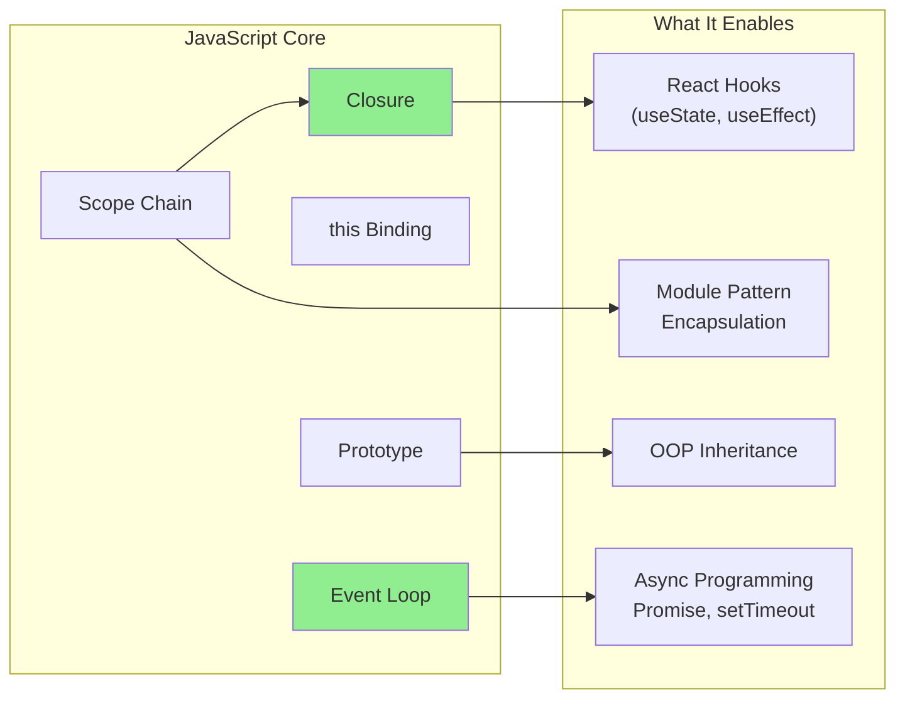
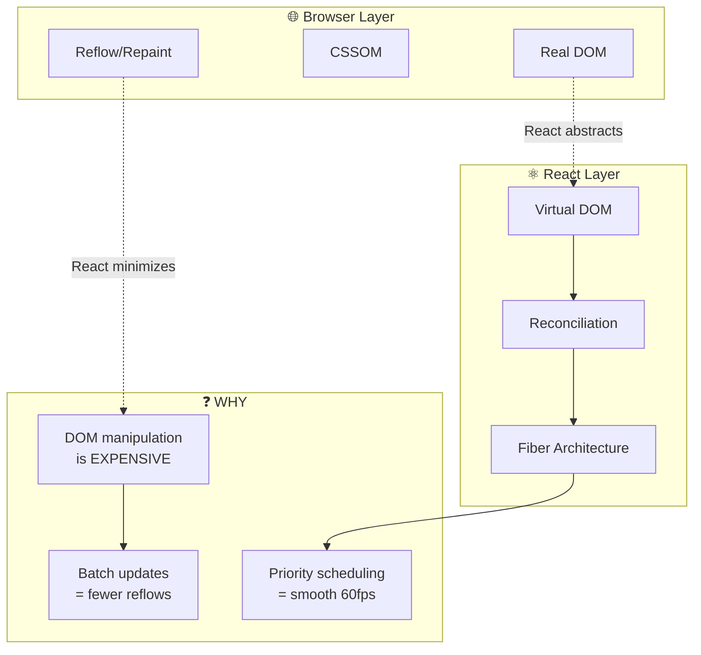
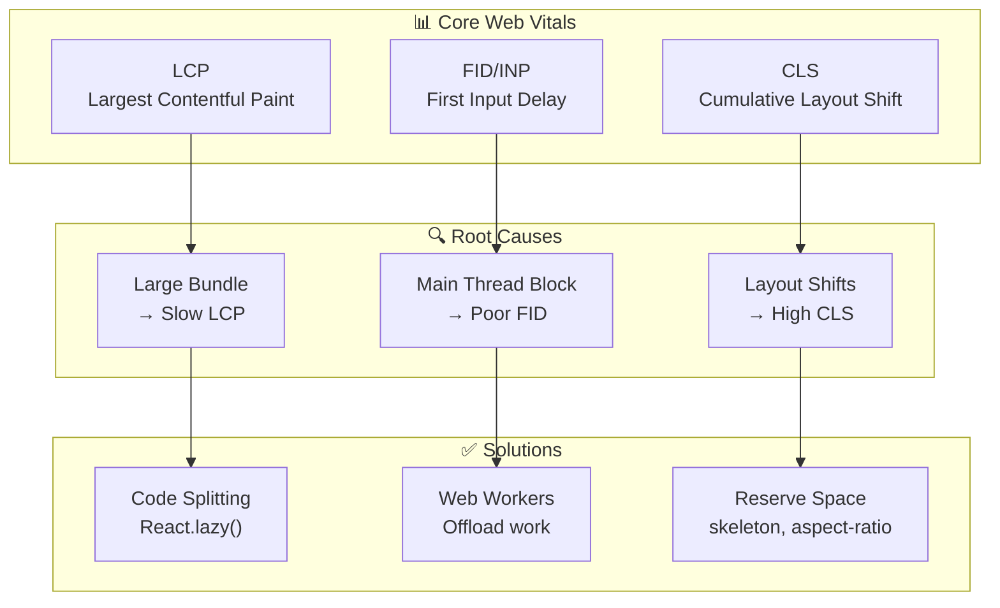
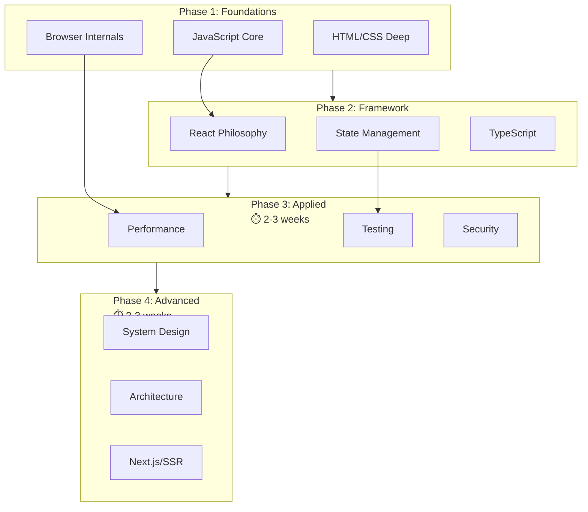

# 🗺️ MODULE 0: KNOWLEDGE MAP

> **Mục đích**: Hiểu cách các khái niệm Frontend liên kết với nhau
>
> _"Hiểu mối quan hệ = nhớ lâu hơn, trả lời phỏng vấn tốt hơn"_

---

## 📊 The Big Picture

### Frontend Ecosystem Overview



---

## 🔗 Concept Relationship Map

### JavaScript Core Connections



> **🔑 Key Insight**: Closures là nền tảng của React Hooks. Hiểu closure = hiểu tại sao hooks hoạt động.

---

### Browser & React Connection



---

### Performance Dependency Graph



---

## 📚 Learning Path Flowchart

### Recommended Study Order



---

## 🎯 Topic Dependency Graph

### What to Learn Before What

| Topic                   | Cần học trước     | Tại sao                          |
| ----------------------- | ----------------- | -------------------------------- |
| **React Hooks**         | Closures, this    | useState lưu state trong closure |
| **Virtual DOM**         | Real DOM, Reflow  | Hiểu vấn đề mới hiểu giải pháp   |
| **TypeScript Generics** | JS Functions      | Generics = function for types    |
| **Next.js SSR**         | React, HTTP       | SSR kết hợp cả hai               |
| **Web Workers**         | Event Loop        | Workers tạo thread riêng         |
| **Service Workers**     | Promises, Caching | SW = async caching layer         |

---

## 🧠 Mental Model: Frontend Architecture

```
┌─────────────────────────────────────────────────────────────┐
│                    USER INTERACTION                          │
├─────────────────────────────────────────────────────────────┤
│  ┌─────────────┐  ┌─────────────┐  ┌─────────────┐         │
│  │   HTML      │  │    CSS      │  │ JavaScript  │         │
│  │  (Structure)│  │   (Style)   │  │  (Behavior) │         │
│  └──────┬──────┘  └──────┬──────┘  └──────┬──────┘         │
│         │                │                │                 │
│         ▼                ▼                ▼                 │
│  ┌─────────────────────────────────────────────────────┐   │
│  │              BROWSER ENGINE                          │   │
│  │  ┌─────────┐  ┌─────────┐  ┌─────────────────────┐  │   │
│  │  │   DOM   │  │  CSSOM  │  │   JavaScript Engine  │  │   │
│  │  │  Tree   │  │  Tree   │  │   (V8, SpiderMonkey) │  │   │
│  │  └────┬────┘  └────┬────┘  └──────────┬──────────┘  │   │
│  │       └──────┬─────┘                  │              │   │
│  │              ▼                        │              │   │
│  │       ┌──────────────┐               │              │   │
│  │       │ Render Tree  │◄──────────────┘              │   │
│  │       └──────┬───────┘                              │   │
│  │              ▼                                       │   │
│  │  ┌─────────────────────────────────────────────┐    │   │
│  │  │  Layout → Paint → Composite → DISPLAY       │    │   │
│  │  └─────────────────────────────────────────────┘    │   │
│  └─────────────────────────────────────────────────────┘   │
├─────────────────────────────────────────────────────────────┤
│                      NETWORK LAYER                          │
│  ┌──────────┐  ┌──────────┐  ┌──────────┐  ┌──────────┐   │
│  │   HTTP   │  │  DNS     │  │  Cache   │  │ WebSocket│   │
│  └──────────┘  └──────────┘  └──────────┘  └──────────┘   │
└─────────────────────────────────────────────────────────────┘
```

---

## 📖 Module Navigation

| Module                                       | Chủ đề                 | Focus       |
| -------------------------------------------- | ---------------------- | ----------- |
| **[Module 1](./01-javascript-theory.md)**    | JavaScript Core Theory | 80% Theory  |
| **[Module 2](./02-browser-theory.md)**       | Browser & Runtime      | 75% Theory  |
| **[Module 3](./03-react-philosophy.md)**     | React Philosophy       | 70% Theory  |
| **[Module 4](./04-architecture-theory.md)**  | Web Architecture       | 70% Theory  |
| **[Module 5](./05-typescript-theory.md)**    | TypeScript Types       | 60% Theory  |
| **[Module 6](./06-framework-patterns.md)**   | Framework Patterns     | 40% Theory  |
| **[Module 7](./07-performance-security.md)** | Performance & Security | 60% Theory  |
| **[Module 8](./08-testing-devops.md)**       | Testing & DevOps       | 50% Theory  |
| **[Module 9](./09-coding-practice.md)**      | Coding Practice        | 30% Theory  |
| **[Module 10](./10-interview-prep.md)**      | Interview Prep         | Q&A         |
| **[Module 11](./11-quick-reference.md)**     | Quick Reference        | Cheat Sheet |

---

## 🔑 Key Takeaways

> [!TIP] > **3 Cách nhớ kiến thức lâu hơn:**
>
> 1. **Hiểu WHY** - Tại sao khái niệm này tồn tại
> 2. **Liên kết** - Nó kết nối với khái niệm nào khác
> 3. **Ứng dụng** - Dùng trong tình huống thực tế nào

---

> _Tiếp theo: [Module 1: JavaScript Core Theory](./01-javascript-theory.md)_
