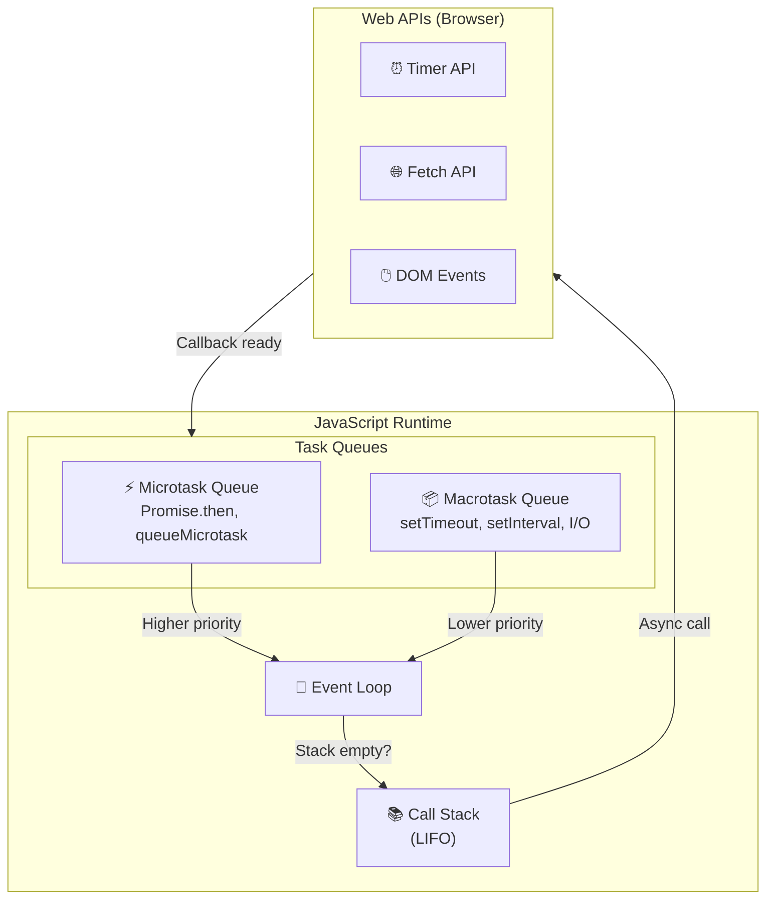
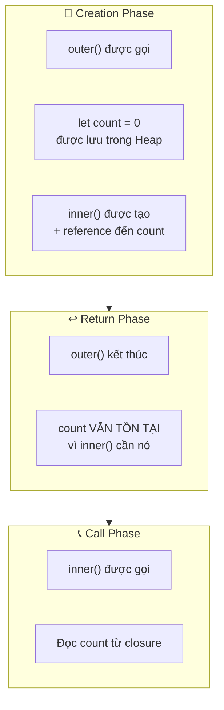
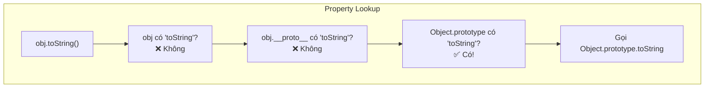
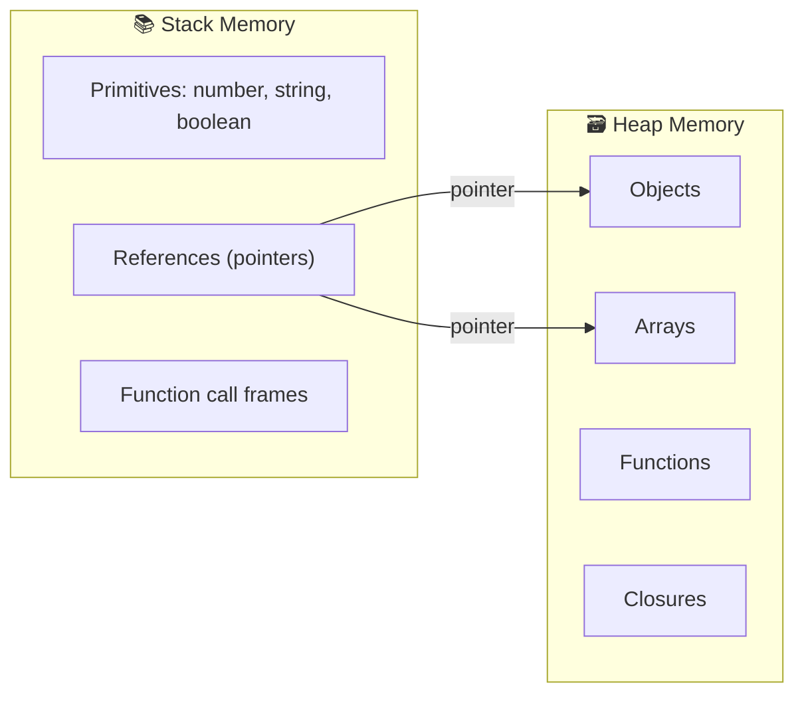
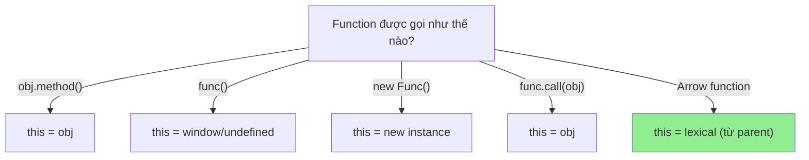
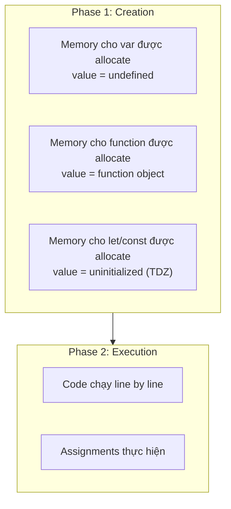
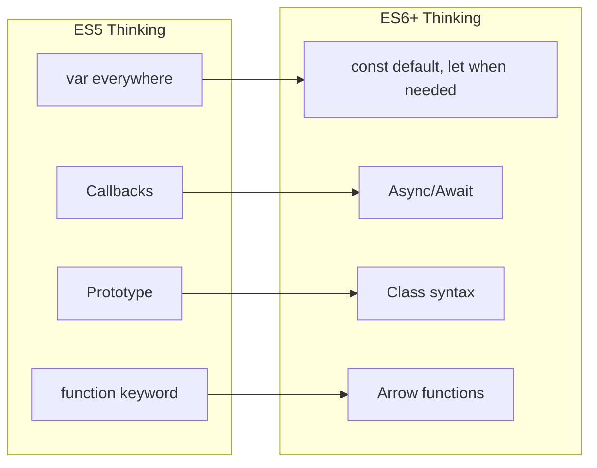

# 🧠 MODULE 1: JAVASCRIPT CORE THEORY

> **Focus**: 80% Theory - 20% Examples
>
> _Hiểu BẢN CHẤT - không chỉ cú pháp_

---

## 📋 Trong Module Này

1. [Event Loop - Bản Chất](#1-event-loop---bản-chất)
2. [Closure - Mental Model](#2-closure---mental-model)
3. [Prototype Chain - Triết Lý](#3-prototype-chain---triết-lý)
4. [Memory & Garbage Collection](#4-memory--garbage-collection)
5. [this Binding - Quy Tắc](#5-this-binding---quy-tắc)
6. [Scope & Hoisting - Cơ Chế](#6-scope--hoisting---cơ-chế)
7. [ES6+ - Paradigm Shifts](#7-es6---paradigm-shifts)

---

## 1. Event Loop - Bản Chất

### ❓ WHAT - Event Loop là gì?

Event Loop là **cơ chế điều phối** giúp JavaScript (ngôn ngữ single-threaded) có thể xử lý các tác vụ bất đồng bộ mà không block main thread.

```
JavaScript = Single-threaded + Event Loop = Concurrent (not parallel)
```

### 🔍 HOW - Hoạt động như thế nào?



**Thứ tự thực thi:**

```
1. Synchronous code (Call Stack) → chạy hết
2. Microtasks (ALL) → chạy hết
3. ONE Macrotask → chạy 1 cái
4. Microtasks (ALL) → lại chạy hết
5. Render (nếu cần)
6. Quay lại bước 3
```

### 💡 WHY - Tại sao thiết kế như vậy?

| Vấn đề                                  | Giải pháp Event Loop                                                           |
| --------------------------------------- | ------------------------------------------------------------------------------ |
| **Single-threaded** nhưng cần xử lý I/O | Delegate cho Web APIs, nhận callback sau                                       |
| **Blocking** sẽ freeze UI               | Non-blocking model, defer work                                                 |
| **Data consistency** với Promise        | Microtasks ưu tiên hơn để đảm bảo Promise chain hoàn thành trước khi UI update |

> [!TIP] > **Tại sao Microtask ưu tiên hơn Macrotask?**
>
> Promise liên quan đến **data consistency** - bạn muốn dữ liệu được cập nhật NGAY trước khi bất kỳ timer nào chạy. Nếu không, state có thể inconsistent.

### 🔗 Cross-References

- → [Module 2: Browser Runtime](./02-browser-theory.md) - Rendering cycle liên kết với Event Loop
- → [Module 3: React Philosophy](./03-react-philosophy.md) - React batches updates trong microtask

---

## 2. Closure - Mental Model

### ❓ WHAT - Closure là gì?

**Closure = Function + Lexical Environment (biến từ scope bên ngoài)**

Khi một function được tạo, nó **"nhớ"** các biến từ scope nơi nó được định nghĩa, kể cả khi function đó được gọi ở nơi khác.

### 🔍 HOW - Closure hình thành như thế nào?



**Mental Model - Cái ba lô:**

```
┌────────────────────────────────────────┐
│  Function inner() mang theo "ba lô"   │
│  chứa tất cả các biến nó cần          │
│                                        │
│  🎒 Backpack of inner():              │
│     ├── count (từ outer)              │
│     └── ... (các biến khác)           │
│                                        │
│  Ba lô này đi theo function           │
│  bất kể function được gọi ở đâu       │
└────────────────────────────────────────┘
```

### 💡 WHY - Tại sao cần Closure?

| Use Case                | Tại sao cần Closure                        |
| ----------------------- | ------------------------------------------ |
| **Private variables**   | Ẩn state, chỉ expose methods               |
| **Function factories**  | Tạo functions với config khác nhau         |
| **Partial application** | "Ghi nhớ" một số arguments                 |
| **React Hooks**         | useState, useEffect lưu state giữa renders |

> [!IMPORTANT] > **Closure trong React Hooks:**
>
> Khi bạn dùng `useState`, React giữ array of state values. Closure cho phép mỗi render "nhớ" đúng state index của nó. Đó là lý do hooks phải gọi theo thứ tự cố định.

### ⚠️ Gotcha: Stale Closure

```javascript
// Vấn đề: closure "nhớ" giá trị cũ
for (var i = 0; i < 3; i++) {
  setTimeout(() => console.log(i), 100);
}
// Output: 3, 3, 3 (không phải 0, 1, 2)

// Giải thích: setTimeout callback closure "nhớ" REFERENCE
// đến i, không phải VALUE. Khi callback chạy, i = 3.
```

### 🔗 Cross-References

- → [Module 3: React Hooks](./03-react-philosophy.md#hooks) - Hooks sử dụng closure
- → Section 6: Scope - Closure dựa trên lexical scope

---

## 3. Prototype Chain - Triết Lý

### ❓ WHAT - Prototype là gì?

JavaScript sử dụng **prototypal inheritance** - objects kế thừa trực tiếp từ objects khác, không cần class (class chỉ là syntax sugar).

```
Mọi object đều có [[Prototype]] - một link đến object khác
```

### 🔍 HOW - Prototype chain hoạt động?



**Chain visualization:**

```
myObj
  │
  └──► myObj.__proto__ (= Constructor.prototype)
         │
         └──► Object.prototype
                │
                └──► null (end of chain)
```

### 💡 WHY - Tại sao JavaScript chọn Prototype?

| Aspect          | Class-based (Java)        | Prototype-based (JS)        |
| --------------- | ------------------------- | --------------------------- |
| **Inheritance** | Copy structure            | Link to object              |
| **Memory**      | Mỗi instance copy methods | Share methods qua prototype |
| **Flexibility** | Fixed at compile time     | Dynamic, có thể modify      |
| **Philosophy**  | "IS-A" relationship       | "BEHAVES-LIKE" relationship |

> [!NOTE] > **ES6 Class = Syntactic Sugar**
>
> `class Dog extends Animal` vẫn sử dụng prototype chain bên dưới. Class chỉ là cú pháp dễ đọc hơn cho những dev quen với OOP truyền thống.

### 🔗 Cross-References

- → [Module 5: TypeScript](./05-typescript-theory.md) - Structural typing tương tự prototype philosophy

---

## 4. Memory & Garbage Collection

### ❓ WHAT - JavaScript quản lý memory như thế nào?

JavaScript tự động quản lý memory với **Garbage Collection** - dev không cần malloc/free như C.

### 🔍 HOW - Memory được tổ chức?



**Mark-and-Sweep Algorithm:**

```
1. GC starts từ "roots" (global, call stack)
2. MARK: Traverse tất cả reachable objects
3. SWEEP: Delete unreachable objects
4. COMPACT: Defragment memory (optional)
```

### 💡 WHY - Memory Leaks vẫn xảy ra?

| Nguyên nhân              | Tại sao GC không dọn được          |
| ------------------------ | ---------------------------------- |
| **Global variables**     | Always reachable from root         |
| **Forgotten timers**     | setInterval callback giữ reference |
| **Closures giữ ref lớn** | Closure "nhớ" entire scope         |
| **Detached DOM nodes**   | JS reference đến DOM đã xóa        |
| **Event listeners**      | Không removeEventListener          |

> [!WARNING] > **Common Leak Pattern:**
>
> ```javascript
> // Closure giữ ENTIRE outer scope
> function outer() {
>   const hugeData = new Array(1000000);
>   return function inner() {
>     console.log("I don't use hugeData");
>   };
>   // hugeData VẪN bị giữ vì inner closure reference outer scope
> }
> ```

---

## 5. this Binding - Quy Tắc

### ❓ WHAT - `this` là gì?

`this` là **runtime binding** - giá trị của nó phụ thuộc vào **CÁCH function được gọi**, không phải nơi function được định nghĩa.

### 🔍 HOW - Quy tắc xác định `this`



**Thứ tự ưu tiên (precedence):**

```
1. new binding          → this = new object
2. Explicit (call/bind) → this = specified object
3. Implicit (obj.func)  → this = object
4. Default              → this = global/undefined
5. Arrow function       → this = lexical (bỏ qua tất cả trên)
```

### 💡 WHY - Tại sao Arrow function khác?

Arrow function được thiết kế cho **lexical this** - giải quyết vấn đề "lost this" trong callbacks:

```javascript
// Problem với regular function
class Timer {
  constructor() {
    this.seconds = 0;
    setInterval(function () {
      this.seconds++; // ❌ this = window, not Timer
    }, 1000);
  }
}

// Solution với arrow function
class Timer {
  constructor() {
    this.seconds = 0;
    setInterval(() => {
      this.seconds++; // ✅ this = Timer instance
    }, 1000);
  }
}
```

---

## 6. Scope & Hoisting - Cơ Chế

### ❓ WHAT - Scope là gì?

**Scope = vùng mà biến có thể được truy cập**

| Type         | Created by          | Visibility      |
| ------------ | ------------------- | --------------- |
| **Global**   | Default             | Everywhere      |
| **Function** | `function`          | Inside function |
| **Block**    | `{}` with let/const | Inside block    |

### 🔍 HOW - Hoisting hoạt động?



**Mental Model:**

```
// Bạn viết:
console.log(x);  // undefined (not error!)
console.log(y);  // ReferenceError: Cannot access 'y' before initialization
var x = 1;
let y = 2;

// JS "hiểu":
var x;           // Hoisted, initialized = undefined
// --- TDZ cho y bắt đầu ---
console.log(x);  // undefined
console.log(y);  // TDZ! Error
let y;           // TDZ kết thúc
x = 1;
y = 2;
```

### 💡 WHY - Temporal Dead Zone (TDZ) tồn tại?

TDZ là **feature, không phải bug**:

- Bắt lỗi sử dụng biến trước khi khai báo
- Đảm bảo const thực sự constant
- Ngăn chặn patterns confusing từ var hoisting

---

## 7. ES6+ - Paradigm Shifts

### Những thay đổi tư duy quan trọng



### Key Paradigm Shifts

| ES5           | ES6+              | Why the Change                     |
| ------------- | ----------------- | ---------------------------------- |
| `var`         | `const`/`let`     | Block scope, no hoisting confusion |
| Callbacks     | Promises/Async    | Readable async code                |
| `.prototype`  | `class`           | Familiar OOP syntax                |
| `function()`  | `() =>`           | Lexical `this`, shorter syntax     |
| String concat | Template literals | Cleaner string interpolation       |
| `arguments`   | Rest params       | Real array, clearer intent         |

---

## 📚 Summary - Mental Models

| Concept        | Mental Model                                                |
| -------------- | ----------------------------------------------------------- |
| **Event Loop** | Traffic controller: Stack → Micros → 1 Macro → Repeat       |
| **Closure**    | Function carries a backpack of outer variables              |
| **Prototype**  | Chain of fallback objects for property lookup               |
| **Memory**     | Primitives in Stack, Objects in Heap, GC cleans unreachable |
| **this**       | Not where defined, but HOW called                           |
| **Scope**      | Nested boxes - inner can see outer, not reverse             |

---

## 🔗 Navigation

| Prev                                   | Module                   | Next                                     |
| -------------------------------------- | ------------------------ | ---------------------------------------- |
| [Knowledge Map](./00-knowledge-map.md) | **1. JavaScript Theory** | [Browser Theory](./02-browser-theory.md) |

---

> _Tiếp theo: [Module 2: Browser & Runtime Theory](./02-browser-theory.md)_
