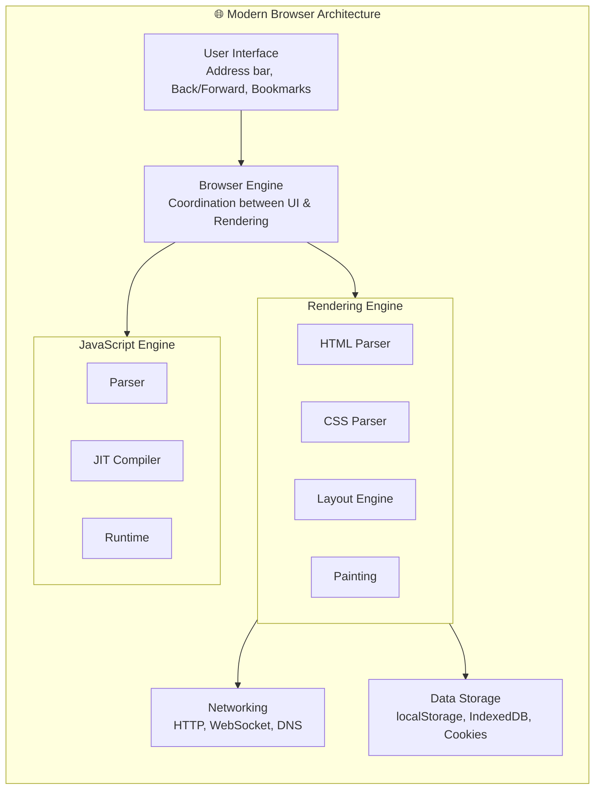
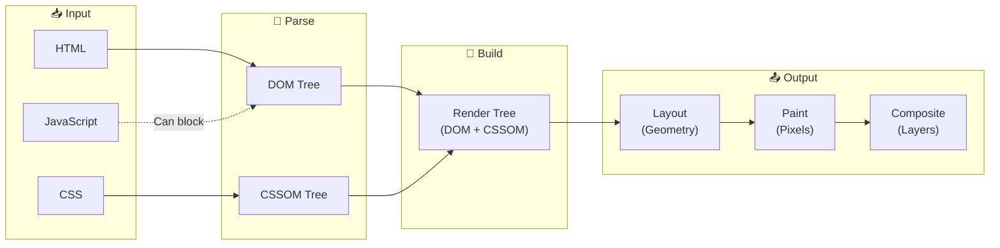
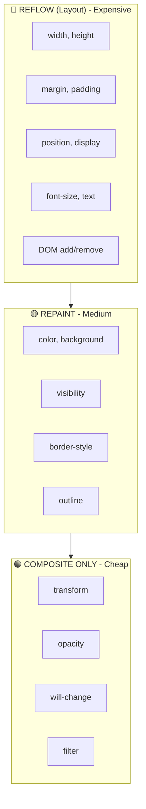
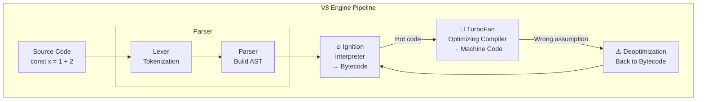
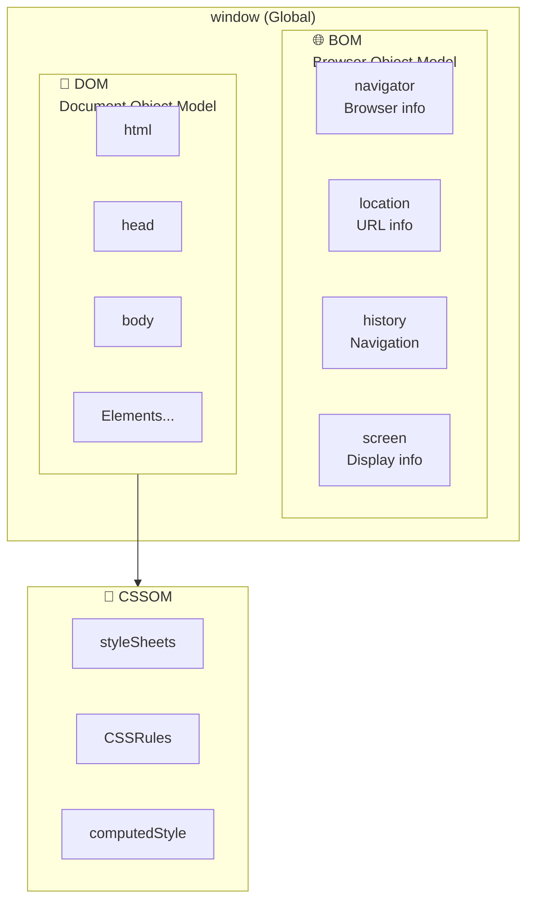
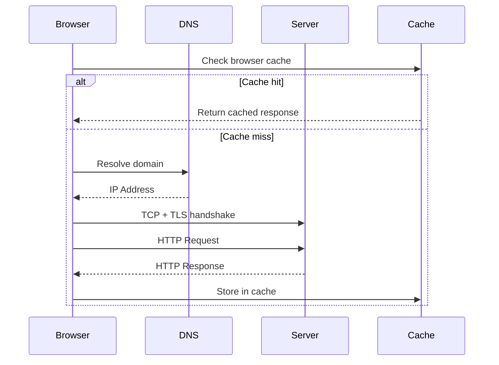
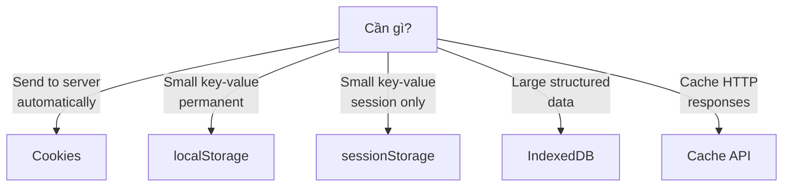

# 🌐 MODULE 2: BROWSER & RUNTIME THEORY

> **Focus**: 75% Theory - 25% Diagrams
>
> _Hiểu cách browser biến code thành pixels_

---

## 📋 Trong Module Này

1. [Browser Architecture Overview](#1-browser-architecture-overview)
2. [Critical Rendering Path](#2-critical-rendering-path)
3. [Reflow vs Repaint](#3-reflow-vs-repaint)
4. [V8 Engine Internals](#4-v8-engine-internals)
5. [DOM, BOM, CSSOM Architecture](#5-dom-bom-cssom-architecture)
6. [Network Layer](#6-network-layer)
7. [Browser Storage Philosophy](#7-browser-storage-philosophy)

---

## 1. Browser Architecture Overview

### ❓ WHAT - Browser bao gồm những gì?



### 💡 WHY - Tại sao cần hiểu architecture?

| Kiến thức              | Ứng dụng                                   |
| ---------------------- | ------------------------------------------ |
| **Rendering pipeline** | Tối ưu performance, tránh layout thrashing |
| **JS Engine**          | Viết code V8-friendly                      |
| **Network layer**      | Caching strategy, preloading               |
| **Storage**            | Chọn đúng storage cho use case             |

---

## 2. Critical Rendering Path

### ❓ WHAT - Đường đi từ HTML đến Pixels?



### 🔍 HOW - Chi tiết từng bước

| Step               | Description                              | Output        |
| ------------------ | ---------------------------------------- | ------------- |
| **1. Parse HTML**  | Tokenize → Build DOM tree                | DOM Tree      |
| **2. Parse CSS**   | Parse stylesheets → Build CSSOM          | CSSOM Tree    |
| **3. Render Tree** | Combine DOM + CSSOM (visible nodes only) | Render Tree   |
| **4. Layout**      | Calculate exact position & size          | Layout Tree   |
| **5. Paint**       | Fill in pixels for text, colors, images  | Paint Records |
| **6. Composite**   | Combine layers (transform, opacity)      | Final Frame   |

### 💡 WHY - Parser Blocking là gì?

```
┌─────────────────────────────────────────────────────────────┐
│  <head>                                                     │
│    <link rel="stylesheet" href="style.css">  ← CSS blocks  │
│    <script src="app.js"></script>            ← JS blocks   │
│  </head>                                                    │
│                                                             │
│  ⚠️ Browser phải:                                          │
│     1. Download CSS trước khi continue parsing             │
│     2. Download & Execute JS trước khi continue            │
│                                                             │
│  ✅ Solutions:                                              │
│     - <script defer> : Download parallel, execute after    │
│     - <script async> : Download parallel, execute ASAP     │
│     - CSS in <head>, JS at end of <body>                   │
└─────────────────────────────────────────────────────────────┘
```

### 🔗 Cross-References

- → [Module 7: Performance](./07-performance-security.md) - Optimize CRP for Core Web Vitals

---

## 3. Reflow vs Repaint

### ❓ WHAT - Khi nào browser phải làm lại?

| Action              | Trigger                             | Cost      |
| ------------------- | ----------------------------------- | --------- |
| **Reflow (Layout)** | Thay đổi geometry (size, position)  | 🔴 HIGH   |
| **Repaint**         | Thay đổi visual (color, visibility) | 🟡 MEDIUM |
| **Composite**       | Thay đổi transform, opacity         | 🟢 LOW    |

### 🔍 HOW - Cái gì trigger cái gì?



### 💡 WHY - Layout Thrashing là gì?

**Layout Thrashing** = đọc rồi viết layout properties liên tục, force browser tính layout nhiều lần.

```javascript
// ❌ BAD - Layout Thrashing
for (let i = 0; i < 100; i++) {
  element.style.width = element.offsetWidth + 10 + "px";
  // 👆 Read (offsetWidth) force layout
  // 👆 Write (style.width) invalidate layout
  // Vòng lặp tiếp theo → force layout lại
}

// ✅ GOOD - Batch reads, then writes
const width = element.offsetWidth; // Read once
for (let i = 0; i < 100; i++) {
  widthArray[i] = width + i * 10;
}
for (let i = 0; i < 100; i++) {
  elements[i].style.width = widthArray[i] + "px"; // Write all
}
```

> [!TIP] > **Gold Rules để tránh Reflow:**
>
> 1. Animate `transform` & `opacity` thay vì `left`, `top`
> 2. Batch DOM reads rồi mới writes
> 3. Dùng `will-change` báo trước cho browser
> 4. Avoid reading layout props trong animation loop

---

## 4. V8 Engine Internals

### ❓ WHAT - V8 compile JS như thế nào?



### 🔍 HOW - JIT Compilation hoạt động?

| Phase              | Engine   | Description                            |
| ------------------ | -------- | -------------------------------------- |
| **Parsing**        | Parser   | Source → AST                           |
| **Baseline**       | Ignition | AST → Bytecode (fast, no optimization) |
| **Profiling**      | —        | Monitor hot functions                  |
| **Optimization**   | TurboFan | Bytecode → Optimized Machine Code      |
| **Deoptimization** | —        | Back to Bytecode if assumptions wrong  |

### 💡 WHY - V8 cần Deoptimize?

TurboFan optimize dựa trên **assumptions** về types:

```javascript
function add(a, b) {
  return a + b;
}

add(1, 2); // V8: "a và b là numbers"
add(3, 4); // V8: "Vẫn numbers, optimize!"
add("a", "b"); // V8: "Ối! Strings! Deoptimize..."
```

> [!NOTE] > **Hidden Classes (Shapes)**
>
> V8 tạo "hidden class" cho mỗi object shape. Objects với cùng shape share hidden class → faster property access.
>
> ```javascript
> // ✅ GOOD - Same shape
> const a = { x: 1, y: 2 };
> const b = { x: 3, y: 4 };
>
> // ❌ BAD - Different shapes
> const c = { x: 1 };
> c.y = 2; // Shape changed!
> ```

---

## 5. DOM, BOM, CSSOM Architecture

### ❓ WHAT - Ba "Object Models"?



### 🔍 HOW - Relationships

| Model     | Purpose                  | Access via                                   |
| --------- | ------------------------ | -------------------------------------------- |
| **DOM**   | Document structure       | `document.*`                                 |
| **BOM**   | Browser capabilities     | `window.*`, `navigator.*`, `location.*`      |
| **CSSOM** | Styles & computed values | `getComputedStyle()`, `document.styleSheets` |

### 💡 WHY - DOM access slow?

DOM lives in **rendering engine**, JavaScript in **JS engine**. Communication có overhead.

```
┌─────────────────┐     Bridge     ┌─────────────────┐
│  JS Engine      │ ←───────────→  │  Rendering      │
│  (V8)           │    Costly!     │  Engine         │
│                 │                │  (DOM here)     │
└─────────────────┘                └─────────────────┘

📌 Mỗi lần JS access DOM = cross-engine communication
📌 Batch DOM operations để minimize crossings
```

---

## 6. Network Layer

### ❓ WHAT - Request lifecycle?



### 🔍 HOW - HTTP versions khác nhau?

| Aspect                    | HTTP/1.1     | HTTP/2             | HTTP/3       |
| ------------------------- | ------------ | ------------------ | ------------ |
| **Connections**           | 6 per domain | Single multiplexed | Single, QUIC |
| **Head-of-line blocking** | Yes          | At TCP level       | None (QUIC)  |
| **Header compression**    | No           | HPACK              | QPACK        |
| **Server Push**           | No           | Yes                | Yes          |

### 💡 WHY - HTTP/2 cần single connection?

**Problem HTTP/1.1**: Browser mở 6 connections per domain → TCP overhead lớn.

**Solution HTTP/2**:

- Single TCP connection
- Multiple "streams" trong connection
- Binary framing (không text như HTTP/1)
- Header compression (HPACK)

---

## 7. Browser Storage Philosophy

### ❓ WHAT - Các loại storage?

| Storage            | Size        | Persistence    | Scope        | JS Access |
| ------------------ | ----------- | -------------- | ------------ | --------- |
| **Cookies**        | 4KB         | Expiry date    | Domain       | Yes       |
| **localStorage**   | 5-10MB      | Permanent      | Origin       | Yes       |
| **sessionStorage** | 5-10MB      | Tab lifetime   | Origin + Tab | Yes       |
| **IndexedDB**      | Unlimited   | Permanent      | Origin       | Yes       |
| **Cache API**      | Quota-based | Service Worker | Origin       | Yes       |

### 🔍 HOW - Khi nào dùng gì?



### 💡 WHY - localStorage synchronous là vấn đề?

```javascript
// localStorage is SYNCHRONOUS → blocks main thread
localStorage.setItem("huge", hugeData); // Blocks!

// IndexedDB is ASYNC → non-blocking
const db = await openDB("myDB");
await db.put("store", hugeData); // Non-blocking
```

> [!WARNING] > **Security Note:**
>
> - NEVER store sensitive data in localStorage (XSS can read)
> - Cookies với `HttpOnly` = JS không thể đọc
> - IndexedDB/localStorage obey Same-Origin Policy

---

## 📊 Summary Diagram

```
┌─────────────────────────────────────────────────────────────┐
│                    BROWSER ARCHITECTURE                      │
├──────────────────┬──────────────────┬───────────────────────┤
│   User Interface │  Browser Engine  │      Data Storage     │
│                  │       ↓          │                       │
│     Address Bar  │  ┌───────────┐   │  Cookies              │
│     Navigation   │  │ Rendering │   │  localStorage         │
│     Bookmarks    │  │  Engine   │   │  IndexedDB           │
│                  │  └───────────┘   │  Cache API            │
│                  │       ↓          │                       │
│                  │  ┌───────────┐   │                       │
│                  │  │    JS     │   │                       │
│                  │  │  Engine   │   │                       │
│                  │  │  (V8)     │   │                       │
│                  │  └───────────┘   │                       │
├──────────────────┴───────┬──────────┴───────────────────────┤
│                    Networking Layer                          │
│       DNS → TCP → TLS → HTTP/2 → Response                   │
└─────────────────────────────────────────────────────────────┘
```

---

## 🔗 Cross-References

| Topic                    | Related Module                                                      |
| ------------------------ | ------------------------------------------------------------------- |
| Event Loop integration   | [Module 1: JavaScript Theory](./01-javascript-theory.md#event-loop) |
| Performance optimization | [Module 7: Performance](./07-performance-security.md)               |
| React rendering          | [Module 3: React Philosophy](./03-react-philosophy.md)              |

---

## 🔗 Navigation

| Prev                                           | Module                | Next                                         |
| ---------------------------------------------- | --------------------- | -------------------------------------------- |
| [JavaScript Theory](./01-javascript-theory.md) | **2. Browser Theory** | [React Philosophy](./03-react-philosophy.md) |

---

> _Tiếp theo: [Module 3: React Philosophy](./03-react-philosophy.md)_
