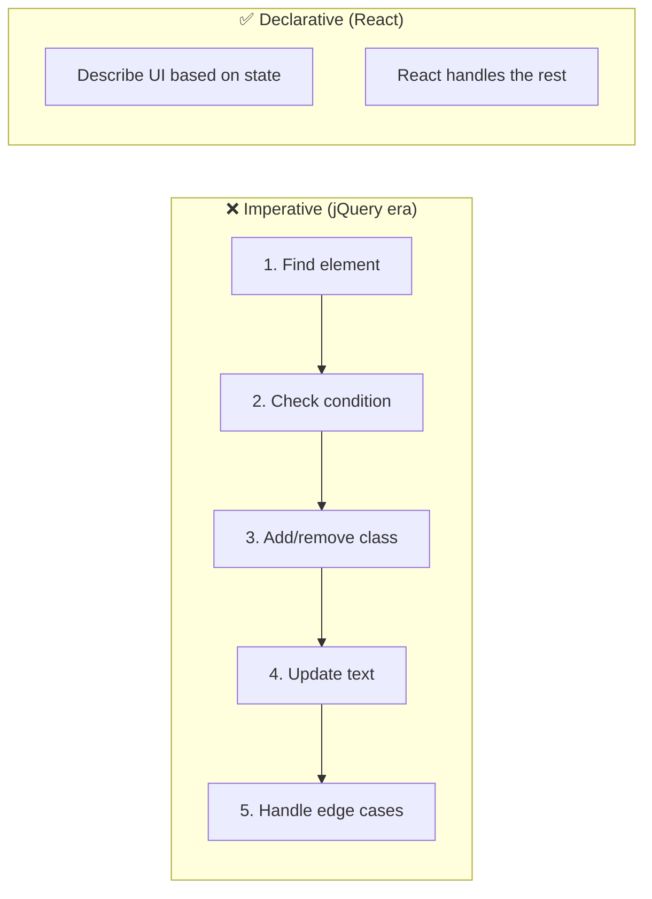
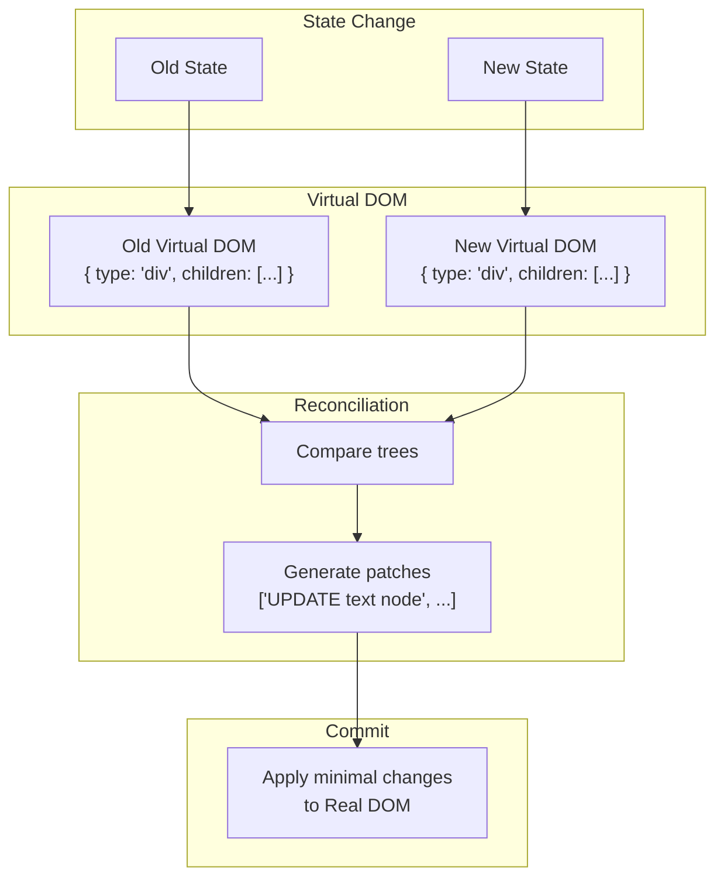
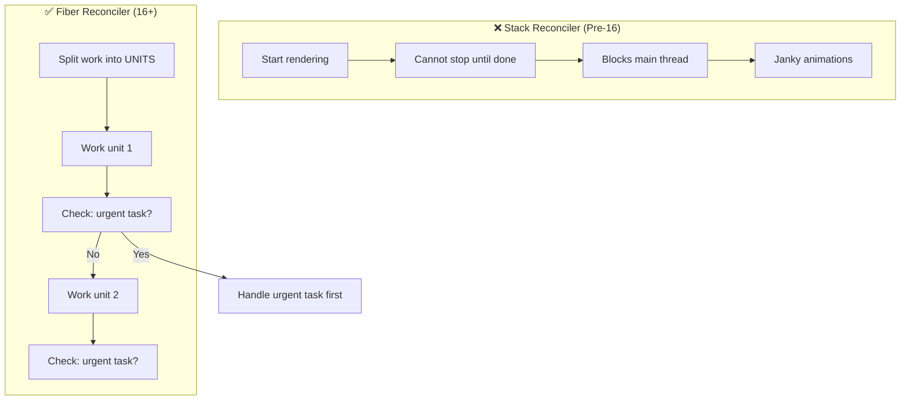
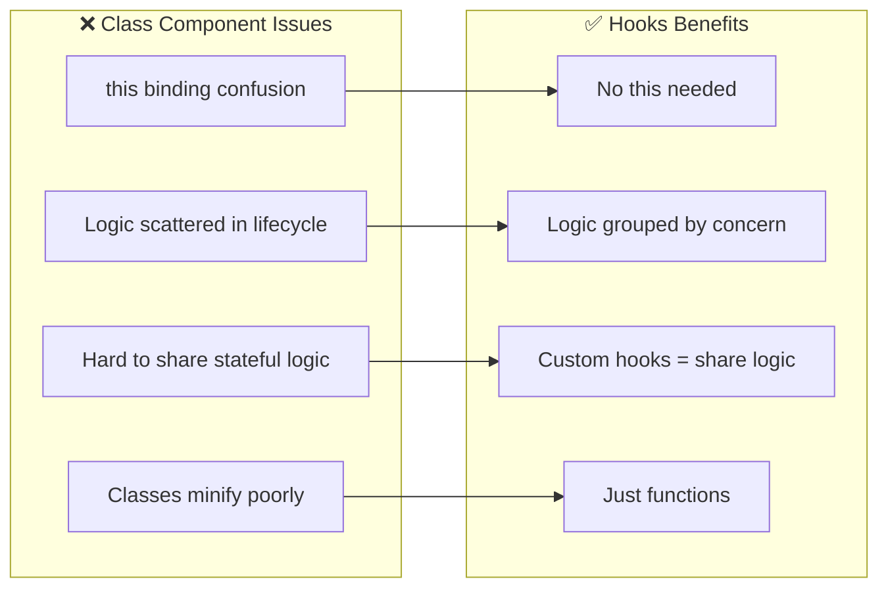
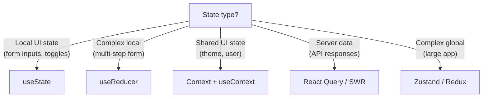
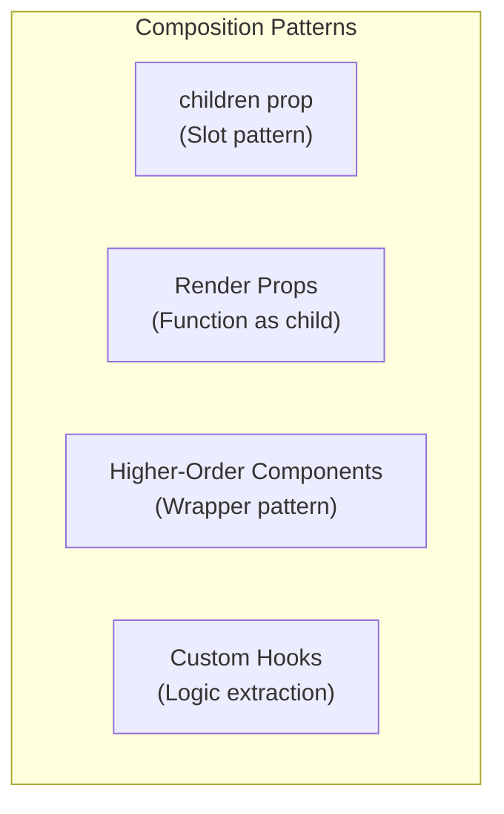

# ⚛️ MODULE 3: REACT PHILOSOPHY

> **Focus**: 70% Theory - 30% Patterns
>
> _Hiểu TẠI SAO React thiết kế như vậy_

---

## 📋 Trong Module Này

1. [Declarative vs Imperative](#1-declarative-vs-imperative)
2. [Virtual DOM Theory](#2-virtual-dom-theory)
3. [React Fiber Architecture](#3-react-fiber-architecture)
4. [Hooks Philosophy](#4-hooks-philosophy)
5. [State Management Philosophy](#5-state-management-philosophy)
6. [Component Composition](#6-component-composition)

---

## 1. Declarative vs Imperative

### ❓ WHAT - Hai paradigms là gì?

| Paradigm        | Focus         | Tell Computer             |
| --------------- | ------------- | ------------------------- |
| **Imperative**  | HOW to do     | Step-by-step instructions |
| **Declarative** | WHAT you want | Desired outcome           |

### 🔍 HOW - Ví dụ thực tế?



```javascript
// ❌ IMPERATIVE - jQuery style
$("#button").on("click", function () {
  const count = parseInt($("#count").text());
  $("#count").text(count + 1);
  if (count + 1 > 10) {
    $("#warning").show();
  }
});

// ✅ DECLARATIVE - React style
function Counter() {
  const [count, setCount] = useState(0);
  return (
    <>
      <span>{count}</span>
      {count > 10 && <Warning />}
      <button onClick={() => setCount((c) => c + 1)}>+</button>
    </>
  );
}
// React tự tính HOW to update DOM
```

### 💡 WHY - React chọn Declarative?

| Benefit          | Explanation                             |
| ---------------- | --------------------------------------- |
| **Predictable**  | UI = f(state) → same input, same output |
| **Maintainable** | Không cần track manual DOM changes      |
| **Optimizable**  | React có thể batch và optimize updates  |
| **Testable**     | Input state → assert output             |

> [!TIP] > **Mental Model:**
>
> Declarative = "Tôi muốn button màu đỏ khi có error"
>
> Imperative = "Khi error xảy ra, tìm button, đổi class thành 'error', set background-color red"

---

## 2. Virtual DOM Theory

### ❓ WHAT - Virtual DOM là gì?

**Virtual DOM = JavaScript object representation của Real DOM**

Thay vì manipulate DOM trực tiếp (expensive), React:

1. Giữ "bản sao" trong memory (Virtual DOM)
2. Khi state thay đổi → tạo Virtual DOM mới
3. So sánh (diff) với Virtual DOM cũ
4. Chỉ update những gì thay đổi trong Real DOM

### 🔍 HOW - Diffing Algorithm hoạt động?



**Diffing Rules:**

```
1. Different TYPE → Replace entire subtree
   <div> → <span> = Unmount div, mount span

2. Same TYPE → Update attributes only
   <div className="a"> → <div className="b"> = Update class

3. Lists → Use KEY to identify items
   Without key: O(n²) comparisons
   With key: O(n) comparisons
```

### 💡 WHY - Tại sao không manipulate DOM trực tiếp?

```
┌────────────────────────────────────────────────────────────┐
│  Real DOM manipulation = EXPENSIVE                         │
│                                                            │
│  Mỗi DOM change có thể trigger:                           │
│    1. Style recalculation                                  │
│    2. Layout (reflow)                                      │
│    3. Paint                                                │
│    4. Composite                                            │
│                                                            │
│  Virtual DOM giúp:                                         │
│    ✓ Batch multiple changes                                │
│    ✓ Minimize actual DOM operations                        │
│    ✓ Calculate diff in fast JS memory                      │
│    ✓ Apply only necessary changes                          │
└────────────────────────────────────────────────────────────┘
```

### 🔗 Cross-References

- → [Module 2: Reflow vs Repaint](./02-browser-theory.md#3-reflow-vs-repaint)

---

## 3. React Fiber Architecture

### ❓ WHAT - Fiber là gì?

**Fiber = React's internal algorithm cho incremental rendering**

Trước React 16: **Stack Reconciler** - synchronous, blocks main thread
Từ React 16: **Fiber Reconciler** - asynchronous, can pause/resume

### 🔍 HOW - Fiber Works?



**Fiber Unit Structure:**

```javascript
// Simplified Fiber Node
{
  type: 'div',           // Component type
  key: 'item-1',         // Unique identifier
  child: FiberNode,      // First child
  sibling: FiberNode,    // Next sibling
  parent: FiberNode,     // Parent node
  stateNode: DOMElement, // Actual DOM node
  pendingProps: {},      // Incoming props
  memoizedState: {},     // Current state
  effectTag: 'UPDATE',   // What to do (UPDATE/PLACEMENT/DELETION)
}
```

### 💡 WHY - Tại sao cần Fiber?

| Problem with Stack     | Fiber Solution                        |
| ---------------------- | ------------------------------------- |
| Large updates block UI | Split into time-sliced chunks         |
| Can't prioritize       | Priority lanes (urgent > background)  |
| Synchronous only       | Async rendering, Suspense, Concurrent |
| All-or-nothing         | Can pause, resume, abort work         |

> [!NOTE] > **Use Cases được Fiber enable:**
>
> - `Suspense` for data fetching
> - `useTransition` for non-urgent updates
> - `useDeferredValue` for background updates
> - Automatic batching trong React 18

---

## 4. Hooks Philosophy

### ❓ WHAT - Tại sao Hooks thay thế Classes?



### 🔍 HOW - Hooks hoạt động internally?

```javascript
// Simplified React Hooks Implementation
let hooks = [];
let currentHook = 0;

function useState(initial) {
  const hookIndex = currentHook;

  if (hooks[hookIndex] === undefined) {
    hooks[hookIndex] = initial; // First render
  }

  const setState = (newValue) => {
    hooks[hookIndex] = newValue;
    rerender(); // Trigger re-render
  };

  currentHook++;
  return [hooks[hookIndex], setState];
}

// WHY: Hooks phải gọi theo ORDER
// React dùng array index để track hooks
// If order changes, hooks point to wrong values!
```

### 💡 WHY - Rules of Hooks tồn tại?

```
┌────────────────────────────────────────────────────────────┐
│  RULE: Only call hooks at TOP LEVEL                        │
│                                                            │
│  ❌ BAD:                                                   │
│  if (condition) {                                          │
│    const [a, setA] = useState(1);  // Index unpredictable │
│  }                                                         │
│                                                            │
│  ✅ GOOD:                                                  │
│  const [a, setA] = useState(1);    // Always index 0      │
│  const [b, setB] = useState(2);    // Always index 1      │
│                                                            │
│  React relies on CALL ORDER to match hooks to their values │
└────────────────────────────────────────────────────────────┘
```

### 🔗 Cross-References

- → [Module 1: Closures](./01-javascript-theory.md#2-closure---mental-model) - useState uses closures

---

## 5. State Management Philosophy

### ❓ WHAT - Khi nào dùng gì?



### 🔍 HOW - Philosophy của từng approach?

| Approach        | Philosophy                  | Best For                       |
| --------------- | --------------------------- | ------------------------------ |
| **useState**    | Simplest, co-located        | Component-specific state       |
| **useReducer**  | Predictable transitions     | Complex state logic            |
| **Context**     | Avoid prop drilling         | Widely-shared, rarely-changing |
| **React Query** | Server state ≠ client state | Caching, sync, refetching      |
| **Zustand**     | Simple global               | Shared state across features   |
| **Redux**       | Single source of truth      | Large teams, time-travel debug |

### 💡 WHY - Server State khác Client State?

```
┌────────────────────────────────────────────────────────────┐
│  CLIENT STATE                 │  SERVER STATE              │
│  (UI owns)                    │  (Backend owns)            │
├───────────────────────────────┼────────────────────────────┤
│  • Modal open/close           │  • User profile            │
│  • Selected tab               │  • Product list            │
│  • Form input values          │  • Comments, posts         │
│  • Theme preference           │  • Search results          │
├───────────────────────────────┼────────────────────────────┤
│  Synchronous                  │  Asynchronous              │
│  Always fresh                 │  Can be stale              │
│  No caching needed            │  Needs caching strategy    │
│  useState is enough           │  React Query/SWR better    │
└────────────────────────────────────────────────────────────┘
```

> [!TIP] > **Decision Framework:**
>
> 1. Can state be derived from props/other state? → Don't store
> 2. Is it component-specific? → useState
> 3. Is it shared by siblings? → Lift to parent
> 4. Is it from server? → React Query
> 5. Is it global UI? → Context or Zustand

---

## 6. Component Composition

### ❓ WHAT - Composition over Inheritance?

React ưu tiên **composition** thay vì inheritance để tái sử dụng code.

### 🔍 HOW - Patterns



**Evolution of Code Sharing:**

```
Mixins (deprecated)
    ↓ "confusing, conflicts"
HOCs
    ↓ "wrapper hell"
Render Props
    ↓ "callback nesting"
Custom Hooks ←── Best for logic sharing
```

### 💡 WHY - React không dùng Inheritance?

| Inheritance Problems | Composition Solution     |
| -------------------- | ------------------------ |
| Tight coupling       | Loose, flexible          |
| "Is-A" forced        | "Has-A" or "Uses"        |
| Diamond problem      | No inheritance hierarchy |
| Hard to change       | Easy to swap components  |

> [!NOTE] > **React Team Quote:**
> "We have never found a use case where we would recommend creating component inheritance hierarchies."

---

## 📊 Summary - React Mental Models

| Concept         | Mental Model                               |
| --------------- | ------------------------------------------ |
| **Declarative** | "What I want" not "How to do"              |
| **Virtual DOM** | Fast JS diff → minimal DOM updates         |
| **Fiber**       | Time-sliced, interruptible rendering       |
| **Hooks**       | Closures + array of state by call order    |
| **State**       | Co-locate where possible, lift when needed |
| **Composition** | Combine small parts, not inherit           |

---

## 🔗 Navigation

| Prev                                     | Module                  | Next                                               |
| ---------------------------------------- | ----------------------- | -------------------------------------------------- |
| [Browser Theory](./02-browser-theory.md) | **3. React Philosophy** | [Architecture Theory](./04-architecture-theory.md) |

---

> _Tiếp theo: [Module 4: Web Architecture Theory](./04-architecture-theory.md)_
