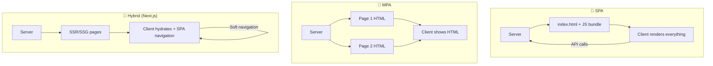
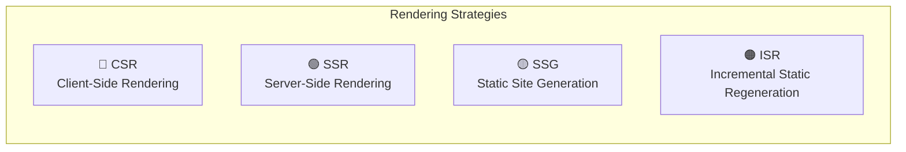
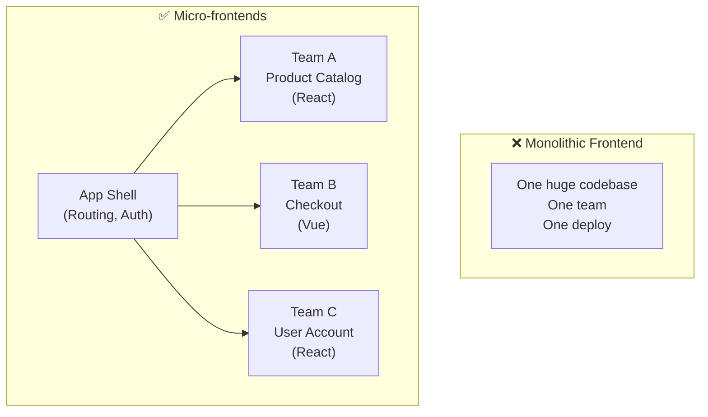
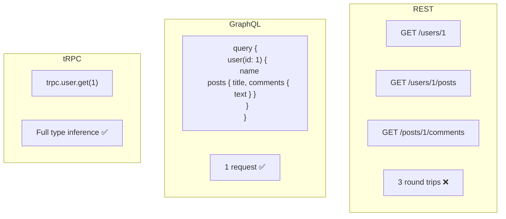
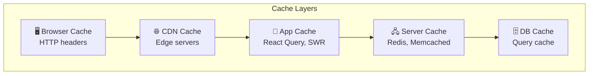
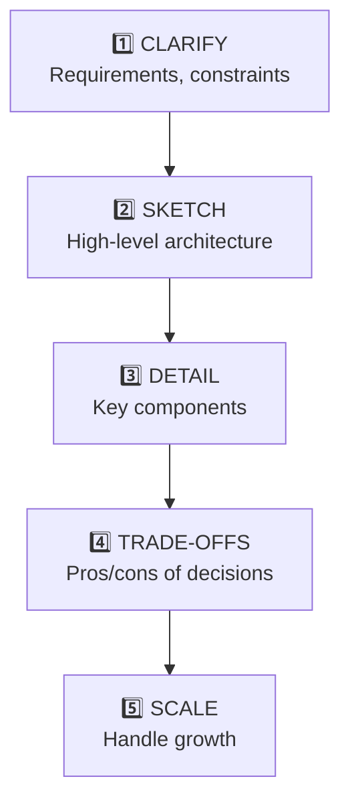

# 🏛️ MODULE 4: WEB ARCHITECTURE THEORY

> **Focus**: 70% Theory - 30% Diagrams
>
> _Hiểu cách thiết kế hệ thống Frontend_

---

## 📋 Trong Module Này

1. [SPA vs MPA vs Hybrid](#1-spa-vs-mpa-vs-hybrid)
2. [Rendering Strategies](#2-rendering-strategies-ssr-ssg-isr-csr)
3. [Micro-frontends Philosophy](#3-micro-frontends-philosophy)
4. [API Patterns](#4-api-patterns)
5. [Caching Strategies](#5-caching-strategies)
6. [Architecture Decision Framework](#6-architecture-decision-framework)

---

## 1. SPA vs MPA vs Hybrid

### ❓ WHAT - Sự khác biệt?

| Aspect           | SPA (Single Page App) | MPA (Multi Page App)  | Hybrid       |
| ---------------- | --------------------- | --------------------- | ------------ |
| **Navigation**   | JavaScript routing    | Full page reload      | Mix          |
| **Initial load** | Slow (large bundle)   | Fast                  | Depends      |
| **SEO**          | Difficult             | Easy                  | Good         |
| **Example**      | Gmail, Figma          | Wikipedia, news sites | Next.js apps |

### 🔍 HOW - Kiến trúc khác nhau?



### 💡 WHY - Khi nào chọn gì?

```
┌────────────────────────────────────────────────────────────┐
│  DECISION TREE                                             │
│                                                            │
│  ┌── SEO critical? ──┐                                     │
│  │                   │                                     │
│  No                  Yes                                   │
│  │                   │                                     │
│  ▼                   ▼                                     │
│  SPA okay        ┌── Dynamic content? ──┐                  │
│  (dashboards,    │                      │                  │
│   apps)          Mostly static          Highly dynamic     │
│                  │                      │                  │
│                  ▼                      ▼                  │
│                  SSG/MPA                SSR/ISR            │
│                  (blogs, docs)          (e-commerce)       │
└────────────────────────────────────────────────────────────┘
```

---

## 2. Rendering Strategies (SSR, SSG, ISR, CSR)

### ❓ WHAT - Các strategies?



### 🔍 HOW - Chi tiết từng strategy?

| Strategy | Khi nào render?      | Cache?    | Fresh data?         |
| -------- | -------------------- | --------- | ------------------- |
| **CSR**  | Browser (client)     | No        | Luôn fresh          |
| **SSR**  | Mỗi request (server) | Optional  | Luôn fresh          |
| **SSG**  | Build time           | Yes (CDN) | Stale until rebuild |
| **ISR**  | Build + revalidate   | Yes (CDN) | Fresh theo interval |

**Visual Timeline:**

```
CSR:     Request → Empty HTML → JS Download → Data Fetch → Render
         |-------- TTFB fast ---||---- FCP slow ----|

SSR:     Request → Server renders → Full HTML → Hydration
         |-- TTFB slow -||------- FCP fast ------|

SSG:     Build → HTML cached at CDN
         Request → Cached HTML (instant)
         |-- TTFB instant --|

ISR:     Like SSG but revalidates in background
         Request 1 → Cached HTML
         (background: regenerate if stale)
         Request 2 → Fresh HTML
```

### 💡 WHY - Chọn strategy nào?

| Use Case               | Best Strategy | Why                                |
| ---------------------- | ------------- | ---------------------------------- |
| **Blog, Docs**         | SSG           | Content ít thay đổi, cache forever |
| **E-commerce product** | ISR           | SEO + prices update hourly         |
| **User dashboard**     | CSR           | Personalized, no SEO needed        |
| **News feed**          | SSR           | Luôn mới, SEO important            |
| **Marketing landing**  | SSG           | Max performance, SEO               |

> [!TIP] > **Next.js App Router Default:**
>
> - Server Components = SSR by default
> - `export const revalidate = 3600` = ISR
> - `'use client'` = CSR for interactive parts

---

## 3. Micro-frontends Philosophy

### ❓ WHAT - Micro-frontends là gì?

**Micro-frontends = Chia frontend thành các phần độc lập, mỗi team own một phần**



### 🔍 HOW - Integration approaches?

| Approach              | How               | Pros              | Cons             |
| --------------------- | ----------------- | ----------------- | ---------------- |
| **Build-time**        | NPM packages      | Type-safe         | Must rebuild all |
| **Server-side**       | SSI, ESI          | Fast initial load | Complex infra    |
| **Run-time (iframe)** | `<iframe>`        | True isolation    | Poor UX, slow    |
| **Run-time (JS)**     | Module Federation | Good balance      | Complexity       |

### 💡 WHY - Khi nào cần Micro-frontends?

```
┌────────────────────────────────────────────────────────────┐
│  ✅ GOOD FIT                    │  ❌ BAD FIT              │
├─────────────────────────────────┼──────────────────────────┤
│  Large team (30+ devs)          │  Small team (< 10 devs)  │
│  Multiple products              │  Single product          │
│  Independent release cycles     │  Coupled features        │
│  Different tech stacks needed   │  Consistent stack        │
│  Autonomous teams               │  Centralized decisions   │
└─────────────────────────────────┴──────────────────────────┘

⚠️ WARNING: Micro-frontends add COMPLEXITY
   Only use if organizational benefits outweigh technical costs
```

---

## 4. API Patterns

### ❓ WHAT - REST vs GraphQL vs tRPC?

| Aspect            | REST                  | GraphQL        | tRPC            |
| ----------------- | --------------------- | -------------- | --------------- |
| **Paradigm**      | Resource-based        | Query language | Type-safe RPC   |
| **Endpoints**     | Many (/users, /posts) | One (/graphql) | Procedures      |
| **Over-fetching** | Common                | Eliminated     | Eliminated      |
| **Type safety**   | Manual                | Schema-based   | Full TypeScript |

### 🔍 HOW - Request patterns?



### 💡 WHY - Chọn pattern nào?

| Scenario                  | Best Choice | Reason                             |
| ------------------------- | ----------- | ---------------------------------- |
| **Public API**            | REST        | Standard, cacheable                |
| **Complex data needs**    | GraphQL     | Flexible queries                   |
| **Full-stack TypeScript** | tRPC        | End-to-end type safety             |
| **Simple CRUD**           | REST        | No overhead                        |
| **Mobile + Web clients**  | GraphQL     | Each client requests what it needs |

---

## 5. Caching Strategies

### ❓ WHAT - Các layers của cache?



### 🔍 HOW - Cache invalidation strategies?

| Strategy                   | How                     | When              |
| -------------------------- | ----------------------- | ----------------- |
| **Time-based (TTL)**       | Expires after X seconds | Static content    |
| **Cache-Control**          | HTTP headers            | Browser/CDN       |
| **Stale-while-revalidate** | Serve stale, fetch new  | API responses     |
| **Tag-based**              | Invalidate by tag       | CMS content       |
| **Event-based**            | Webhook to purge        | Real-time updates |

### 💡 WHY - Cache invalidation khó?

```
┌────────────────────────────────────────────────────────────┐
│  "There are only two hard things in computer science:     │
│   cache invalidation and naming things."                   │
│                                    — Phil Karlton          │
├────────────────────────────────────────────────────────────┤
│  PROBLEMS:                                                 │
│  1. Stale data → Users see outdated info                  │
│  2. Cache stampede → Server overload on expiry            │
│  3. Consistency → Different caches have different data    │
│                                                            │
│  SOLUTIONS:                                                │
│  1. Use versioned URLs: /v2/users                         │
│  2. Stale-while-revalidate pattern                        │
│  3. Event-driven invalidation                             │
└────────────────────────────────────────────────────────────┘
```

---

## 6. Architecture Decision Framework

### System Design Interview Approach



### Key Questions to Ask

| Category        | Questions                             |
| --------------- | ------------------------------------- |
| **Users**       | How many concurrent? Mobile/Desktop?  |
| **Data**        | Volume? Real-time needs?              |
| **Features**    | MVP scope? Must-have vs nice-to-have? |
| **Performance** | Target load time? Offline support?    |
| **Team**        | Size? Skill set? Existing stack?      |

### Decision Matrix Template

| Decision  | Option A    | Option B | Our Choice | Why                    |
| --------- | ----------- | -------- | ---------- | ---------------------- |
| Rendering | CSR         | SSR      | SSR        | SEO critical           |
| State     | Redux       | Zustand  | Zustand    | Simpler for team size  |
| Styling   | CSS Modules | Tailwind | Tailwind   | Faster development     |
| API       | REST        | GraphQL  | GraphQL    | Complex data relations |

---

## 📊 Summary

```
┌────────────────────────────────────────────────────────────┐
│  FRONTEND ARCHITECTURE DECISION TREE                       │
│                                                            │
│  ┌── SEO needed? ──┐                                       │
│  │                 │                                       │
│  No               Yes                                      │
│  │                 │                                       │
│  ▼                 ▼                                       │
│  CSR           ┌── Content type? ──┐                       │
│                │                   │                       │
│            Static            Dynamic                       │
│                │                   │                       │
│                ▼                   ▼                       │
│               SSG              ┌── Update freq? ──┐        │
│                                │                  │        │
│                            Per request       Periodic      │
│                                │                  │        │
│                                ▼                  ▼        │
│                               SSR               ISR        │
└────────────────────────────────────────────────────────────┘
```

---

## 🔗 Navigation

| Prev                                         | Module                     | Next                                           |
| -------------------------------------------- | -------------------------- | ---------------------------------------------- |
| [React Philosophy](./03-react-philosophy.md) | **4. Architecture Theory** | [TypeScript Theory](./05-typescript-theory.md) |

---

> _Tiếp theo: [Module 5: TypeScript Type Theory](./05-typescript-theory.md)_
