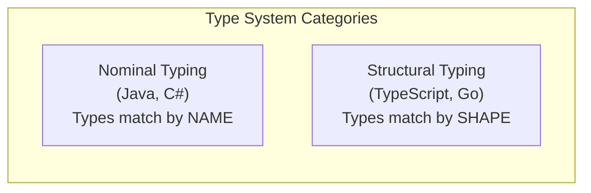
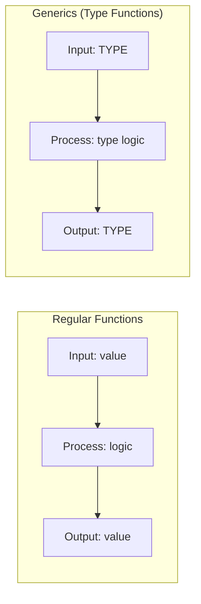
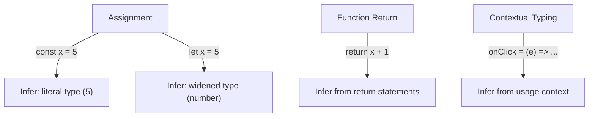
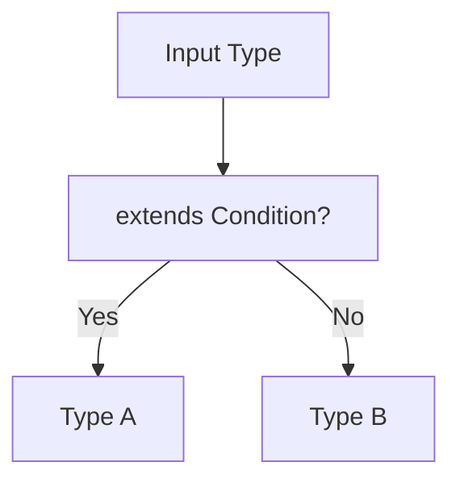
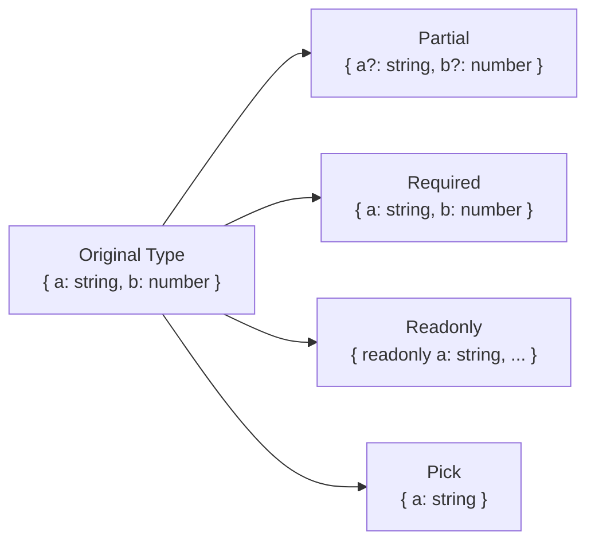
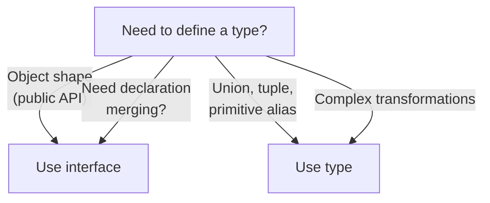

# 🔷 MODULE 5: TYPESCRIPT TYPE THEORY

> **Focus**: 60% Theory - 40% Type Examples
>
> _Hiểu TYPE SYSTEM, không chỉ syntax_

---

## 📋 Trong Module Này

1. [Type System Philosophy](#1-type-system-philosophy)
2. [Generics Mental Model](#2-generics-mental-model)
3. [Type Inference Engine](#3-type-inference-engine)
4. [Conditional Types](#4-conditional-types)
5. [Mapped Types](#5-mapped-types)
6. [Type vs Interface Philosophy](#6-type-vs-interface-philosophy)

---

## 1. Type System Philosophy

### ❓ WHAT - TypeScript type system là gì?



**TypeScript = Structural Typing**

```typescript
// Nominal (Java style) - Sẽ LỖI
class Dog {
  name: string;
}
class Cat {
  name: string;
}
// Dog và Cat là KHÁC type dù cùng shape

// Structural (TypeScript) - OK!
interface Dog {
  name: string;
}
interface Cat {
  name: string;
}
const dog: Dog = { name: "Rex" };
const cat: Cat = dog; // ✅ Same SHAPE = Compatible
```

### 🔍 HOW - Type checking hoạt động?

```
┌────────────────────────────────────────────────────────────┐
│  TypeScript Compilation Pipeline                           │
│                                                            │
│  Source.ts                                                 │
│      │                                                     │
│      ▼                                                     │
│  Parser → AST (Abstract Syntax Tree)                       │
│      │                                                     │
│      ▼                                                     │
│  Type Checker (BẮT LỖI Ở ĐÂY)                             │
│      │                                                     │
│      ▼                                                     │
│  Emitter → JavaScript (KHÔNG CÒN TYPES)                   │
│                                                            │
│  ⚠️ Types chỉ tồn tại ở compile-time, không runtime!      │
└────────────────────────────────────────────────────────────┘
```

### 💡 WHY - Tại sao Structural over Nominal?

| Benefit              | Explanation                         |
| -------------------- | ----------------------------------- |
| **Flexibility**      | Code works if shapes match          |
| **Duck typing**      | "If it walks like a duck..."        |
| **Easy refactoring** | No need to explicitly implement     |
| **JS interop**       | JS objects don't have nominal types |

> [!TIP] > **Mental Model:**
>
> TypeScript hỏi: "Object này CÓ những properties tôi cần không?"
>
> KHÔNG hỏi: "Object này được KHAI BÁO là type gì?"

---

## 2. Generics Mental Model

### ❓ WHAT - Generics là gì?

**Generics = Functions for Types**

Như functions nhận values và trả values, Generics nhận types và trả types.

### 🔍 HOW - Hiểu qua analogy?



```typescript
// Regular function: value → value
function identity(x: any): any {
  return x;
}

// Generic: type → type
function identity<T>(x: T): T {
  return x;
}

// T là "variable" cho types
identity<string>("hello"); // T = string, output = string
identity<number>(42); // T = number, output = number
```

### 💡 WHY - Khi nào cần Generics?

| Pattern                | Use Case                              |
| ---------------------- | ------------------------------------- |
| **Containers**         | `Array<T>`, `Promise<T>`, `Map<K, V>` |
| **Identity functions** | Return same type as input             |
| **Factories**          | Create instances of any type          |
| **Utilities**          | `Partial<T>`, `Pick<T, K>`            |

**Building intuition:**

```typescript
// ❌ Without generics: lose type info
function first(arr: any[]): any {
  return arr[0];
}
const x = first([1, 2, 3]); // x: any 😢

// ✅ With generics: preserve type
function first<T>(arr: T[]): T | undefined {
  return arr[0];
}
const y = first([1, 2, 3]); // y: number 🎉
```

---

## 3. Type Inference Engine

### ❓ WHAT - Inference là gì?

TypeScript **automatically infers** types khi bạn không khai báo explicit.

### 🔍 HOW - Inference rules?



```typescript
// 1️⃣ Literal vs Widening
const x = 5; // Type: 5 (literal)
let y = 5; // Type: number (widened)

// 2️⃣ Return type inference
function add(a: number, b: number) {
  return a + b; // Return type inferred: number
}

// 3️⃣ Contextual typing
const names = ["Alice", "Bob"];
names.map((name) => name.toUpperCase());
//         ^^^^^ TypeScript knows name: string from context

// 4️⃣ Generic inference
function pair<T, U>(a: T, b: U): [T, U] {
  return [a, b];
}
const p = pair(1, "hello"); // Inferred: [number, string]
```

### 💡 WHY - Khi nào để inference, khi nào explicit?

```
┌────────────────────────────────────────────────────────────┐
│  INFERENCE                      │  EXPLICIT                │
│  (Let TypeScript figure out)    │  (You specify)           │
├─────────────────────────────────┼──────────────────────────┤
│  ✅ Variable assignments        │  ✅ Function parameters  │
│  ✅ Return types (usually)      │  ✅ Public API           │
│  ✅ Generic type arguments      │  ✅ Object literals      │
│  ✅ Callback parameters         │  ✅ Complex types        │
└─────────────────────────────────┴──────────────────────────┘
```

---

## 4. Conditional Types

### ❓ WHAT - Conditional Types là gì?

**Conditional Types = Ternary operator for types**

```typescript
Type = Condition extends Check ? TrueType : FalseType
```

### 🔍 HOW - Patterns phổ biến?



```typescript
// Basic conditional
type IsString<T> = T extends string ? true : false;

type A = IsString<"hello">; // true
type B = IsString<123>; // false

// Extract from union
type ExtractStrings<T> = T extends string ? T : never;
type C = ExtractStrings<"a" | 1 | "b">; // "a" | "b"

// Infer keyword - extract types
type GetReturnType<T> = T extends (...args: any[]) => infer R ? R : never;

type D = GetReturnType<() => string>; // string
```

### 💡 WHY - Distributive behavior?

```typescript
// Conditional types DISTRIBUTE over unions
type ToArray<T> = T extends any ? T[] : never;

type E = ToArray<string | number>;
// Distributes: ToArray<string> | ToArray<number>
// Result: string[] | number[]

// 🔧 To prevent distribution, wrap in tuple:
type ToArrayNoDist<T> = [T] extends [any] ? T[] : never;
type F = ToArrayNoDist<string | number>; // (string | number)[]
```

---

## 5. Mapped Types

### ❓ WHAT - Mapped Types là gì?

**Mapped Types = Transform properties of existing type**

```typescript
{ [K in keyof T]: NewType }
```

### 🔍 HOW - Built-in mapped types?



```typescript
// How Partial works internally:
type MyPartial<T> = {
  [K in keyof T]?: T[K];
};

// How Readonly works:
type MyReadonly<T> = {
  readonly [K in keyof T]: T[K];
};

// Custom: Make all properties nullable
type Nullable<T> = {
  [K in keyof T]: T[K] | null;
};

// Key remapping (TS 4.1+)
type Getters<T> = {
  [K in keyof T as `get${Capitalize<K & string>}`]: () => T[K];
};

type Person = { name: string; age: number };
type PersonGetters = Getters<Person>;
// { getName: () => string; getAge: () => number }
```

### 💡 WHY - Power of mapped types?

```
┌────────────────────────────────────────────────────────────┐
│  MAPPED TYPES = DRY Principle for Types                    │
│                                                            │
│  INSTEAD OF:                                               │
│  interface UserRequired { name: string; age: number; }    │
│  interface UserOptional { name?: string; age?: number; }  │
│  interface UserReadonly { readonly name: string; ... }    │
│                                                            │
│  USE:                                                      │
│  interface User { name: string; age: number; }            │
│  type OptionalUser = Partial<User>;                       │
│  type ReadonlyUser = Readonly<User>;                      │
│                                                            │
│  ✅ Single source of truth                                 │
│  ✅ Changes propagate automatically                        │
└────────────────────────────────────────────────────────────┘
```

---

## 6. Type vs Interface Philosophy

### ❓ WHAT - Sự khác biệt?

| Feature                        | interface | type               |
| ------------------------------ | --------- | ------------------ |
| **Extend**                     | `extends` | `&` (intersection) |
| **Declaration merging**        | ✅ Yes    | ❌ No              |
| **Primitives, unions, tuples** | ❌ No     | ✅ Yes             |
| **Computed properties**        | ❌ No     | ✅ Yes             |

### 🔍 HOW - Khi nào dùng gì?



```typescript
// ✅ Interface: Objects, classes, public API
interface User {
  id: number;
  name: string;
}

// ✅ Type: Unions, tuples, computed
type Status = "pending" | "active" | "done";
type Pair<T> = [T, T];
type Getters<T> = { [K in keyof T as `get${K}`]: () => T[K] };

// Declaration merging (only interface)
interface User {
  email: string; // Adds to User
}
```

### 💡 WHY - Recommend interface for objects?

```
┌────────────────────────────────────────────────────────────┐
│  TypeScript Team Recommendation:                           │
│                                                            │
│  "Use interface when you can,                              │
│   type when you must."                                     │
│                                                            │
│  REASONS:                                                  │
│  1. interface có better error messages                    │
│  2. interface có better performance (hợp nhất nhanh hơn)  │
│  3. interface tường minh hơn về intent (shape of object)  │
│                                                            │
│  EXCEPTION: Use type for:                                  │
│  - Unions: type A = B | C                                 │
│  - Tuples: type Pair = [string, number]                   │
│  - Computed/mapped types                                   │
└────────────────────────────────────────────────────────────┘
```

---

## 📊 Summary - TypeScript Mental Models

| Concept               | Mental Model                                     |
| --------------------- | ------------------------------------------------ |
| **Structural typing** | "Does it have the right shape?"                  |
| **Generics**          | "Functions that operate on types"                |
| **Inference**         | "TypeScript figures it out from context"         |
| **Conditional types** | "if-else for types"                              |
| **Mapped types**      | "Transform all keys of a type"                   |
| **interface vs type** | "interface for shapes, type for everything else" |

---

## 🔗 Cross-References

| Topic                  | Related Module                                                        |
| ---------------------- | --------------------------------------------------------------------- |
| React + TypeScript     | [Module 6: Framework Patterns](./06-framework-patterns.md#typescript) |
| JavaScript foundations | [Module 1: JavaScript Theory](./01-javascript-theory.md)              |

---

## 🔗 Navigation

| Prev                                               | Module                   | Next                                             |
| -------------------------------------------------- | ------------------------ | ------------------------------------------------ |
| [Architecture Theory](./04-architecture-theory.md) | **5. TypeScript Theory** | [Framework Patterns](./06-framework-patterns.md) |

---

> _Tiếp theo: [Module 6: Framework Patterns](./06-framework-patterns.md)_
