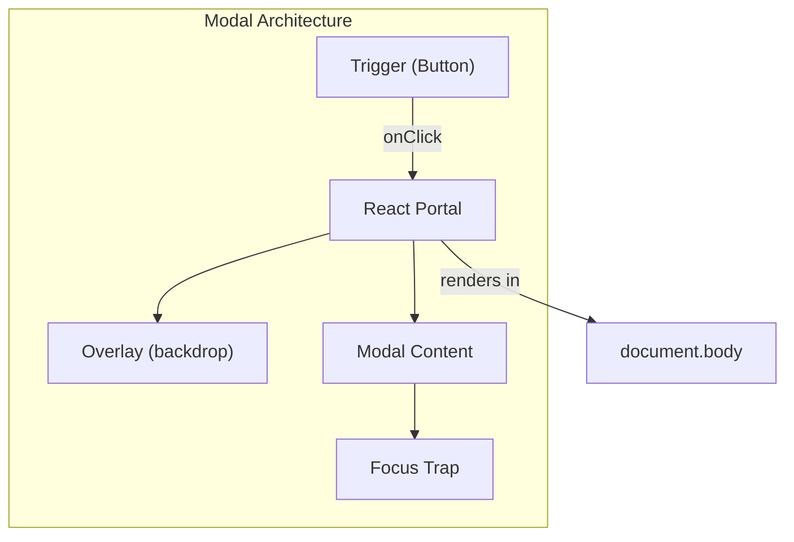
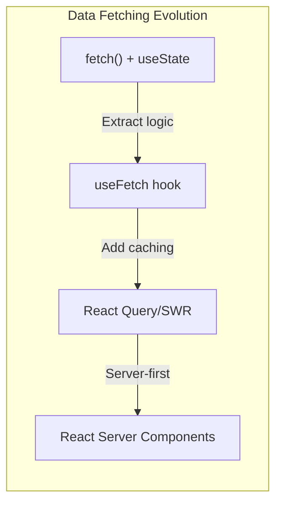
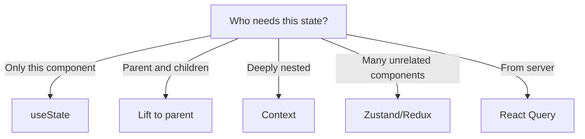
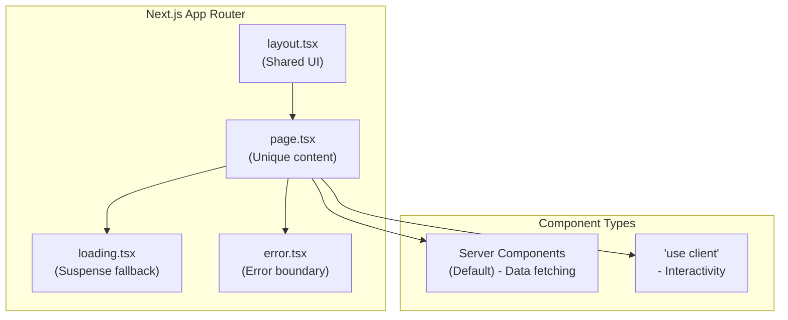

# 🧩 MODULE 6: FRAMEWORK PATTERNS

> **Focus**: 40% Theory - 60% Patterns
>
> _Patterns thực tế với giải thích WHY_

---

## 📋 Trong Module Này

1. [UI Component Patterns](#1-ui-component-patterns)
2. [Data Fetching Patterns](#2-data-fetching-patterns)
3. [State Patterns](#3-state-patterns)
4. [Next.js Patterns](#4-nextjs-patterns)
5. [Animation Patterns](#5-animation-patterns)

---

## 1. UI Component Patterns

### Modal Pattern



**Key Principles:**

| Principle            | Why                                        |
| -------------------- | ------------------------------------------ |
| **Portal**           | Avoid z-index issues, render at body level |
| **Focus trap**       | Accessibility - keep focus inside modal    |
| **Escape to close**  | Expected keyboard behavior                 |
| **Overlay click**    | Common pattern to dismiss                  |
| **Body scroll lock** | Prevent background scroll                  |

### Dropdown Pattern

```
┌────────────────────────────────────────────────────────────┐
│  DROPDOWN: Click outside to close                          │
│                                                            │
│  Implementation:                                           │
│  1. useRef for container                                   │
│  2. useEffect with document click listener                 │
│  3. Check if click target is outside ref                   │
│  4. Close if outside                                       │
│                                                            │
│  Gotcha: Add listener on OPEN, remove on close/unmount    │
└────────────────────────────────────────────────────────────┘
```

### Tabs Pattern

**Accessibility Requirements:**

- `role="tablist"` on container
- `role="tab"` on each tab
- `role="tabpanel"` on content
- `aria-selected` for active tab
- `aria-controls` linking tab to panel
- Arrow keys for navigation

---

## 2. Data Fetching Patterns

### Pattern Comparison



### When to Use What?

| Pattern               | Use When                  | Benefits      |
| --------------------- | ------------------------- | ------------- |
| **Raw fetch**         | Simple one-off requests   | No deps       |
| **Custom hook**       | Reusable fetch logic      | DRY           |
| **React Query**       | Caching, refetching, sync | Full-featured |
| **Server Components** | Initial page data, SEO    | No client JS  |

### React Query Mental Model

```
┌────────────────────────────────────────────────────────────┐
│  React Query = Server State Manager                        │
│                                                            │
│  It handles:                                               │
│  ✓ Caching (don't refetch same data)                      │
│  ✓ Background refetching (keep data fresh)                │
│  ✓ Stale-while-revalidate (show stale, fetch new)         │
│  ✓ Deduplication (multiple components, one request)       │
│  ✓ Retry logic (automatic on failure)                     │
│  ✓ Pagination/Infinite queries                            │
│                                                            │
│  You handle:                                               │
│  ✓ The actual fetch function                               │
│  ✓ Query keys for cache identification                    │
└────────────────────────────────────────────────────────────┘
```

---

## 3. State Patterns

### State Location Decision



### Compound Components Pattern

**Philosophy**: Components that work together, share implicit state.

```
┌────────────────────────────────────────────────────────────┐
│  <Select>                    │  All these share state     │
│    <Select.Trigger />        │  via Context internally    │
│    <Select.Options>          │                            │
│      <Select.Option />       │  User doesn't manage       │
│      <Select.Option />       │  open/close state          │
│    </Select.Options>         │                            │
│  </Select>                   │                            │
└────────────────────────────────────────────────────────────┘
```

### Reducer Pattern

**When useReducer > useState:**

- Complex state with many sub-values
- State transitions have specific logic
- Next state depends on previous
- Want to test state logic independently

---

## 4. Next.js Patterns

### App Router Mental Model



### Server vs Client Components

| Server Components             | Client Components            |
| ----------------------------- | ---------------------------- |
| Can: fetch data directly      | Can: useState, useEffect     |
| Can: access backend resources | Can: onClick, event handlers |
| Cannot: useState, useEffect   | Cannot: direct DB access     |
| Size: 0kb client JS           | Size: Included in bundle     |

**Golden Rule:**

```
📌 Server by default, Client for interactivity
   Start with Server Component
   Add 'use client' only when needed (state, events)
```

### Data Fetching Patterns

```
┌────────────────────────────────────────────────────────────┐
│  Next.js Data Fetching Options                             │
│                                                            │
│  1. Server Component (default)                             │
│     async function Page() {                                │
│       const data = await fetch(...);                       │
│     }                                                      │
│                                                            │
│  2. With revalidation (ISR)                                │
│     fetch(url, { next: { revalidate: 3600 } })            │
│                                                            │
│  3. Server Actions (mutations)                             │
│     'use server'                                           │
│     async function submitForm(data) {                      │
│       // Runs on server, can write to DB                  │
│     }                                                      │
└────────────────────────────────────────────────────────────┘
```

---

## 5. Animation Patterns

### CSS vs JS Animations

| CSS Transitions/Animations | JS Animations         |
| -------------------------- | --------------------- |
| Simple hover, enter/exit   | Complex sequenced     |
| GPU accelerated            | Full control          |
| 60fps by default           | requestAnimationFrame |
| Limited to CSS props       | Any property          |

### Performant Animation Properties

```
┌────────────────────────────────────────────────────────────┐
│  🟢 GPU-ACCELERATED (Composite Only)                       │
│     transform: translate(), scale(), rotate()              │
│     opacity                                                 │
│                                                            │
│  🟡 TRIGGERS REPAINT                                       │
│     color, background, visibility                          │
│                                                            │
│  🔴 TRIGGERS REFLOW (Expensive!)                           │
│     width, height, margin, padding, left, top              │
│                                                            │
│  💡 TIP: Animate transform & opacity for 60fps            │
└────────────────────────────────────────────────────────────┘
```

### Enter/Exit Animations

```
Mount Animation:
  Component mounts → Add "entering" class → Remove after transition

Unmount Animation:
  Trigger "exiting" class → Wait for transition → Unmount component

⚠️ Challenge: React unmounts immediately
   Solution: Delay unmount with onAnimationEnd or Framer Motion
```

---

## 📊 Summary

| Pattern                 | When to Use                     |
| ----------------------- | ------------------------------- |
| **Portal**              | Modals, tooltips, dropdowns     |
| **Compound Components** | Complex UI with implicit state  |
| **React Query**         | Server state with caching       |
| **Server Components**   | Data fetching without client JS |
| **CSS Animations**      | Simple transitions              |
| **Framer Motion**       | Complex enter/exit animations   |

---

## 🔗 Navigation

| Prev                                           | Module                    | Next                                                   |
| ---------------------------------------------- | ------------------------- | ------------------------------------------------------ |
| [TypeScript Theory](./05-typescript-theory.md) | **6. Framework Patterns** | [Performance & Security](./07-performance-security.md) |

---

> _Tiếp theo: [Module 7: Performance & Security](./07-performance-security.md)_
