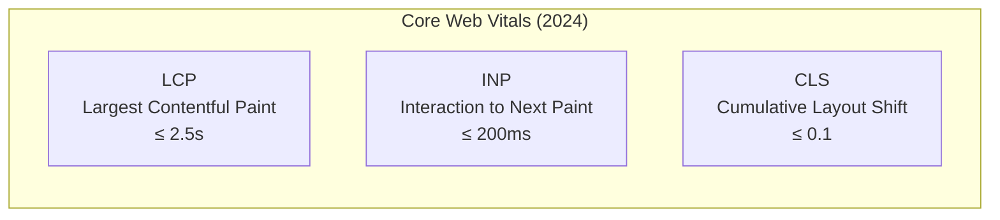
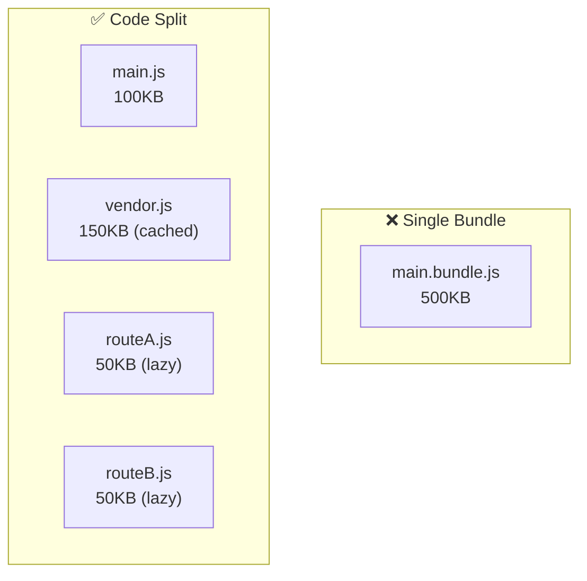
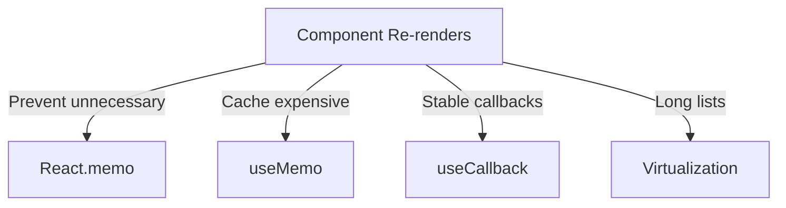
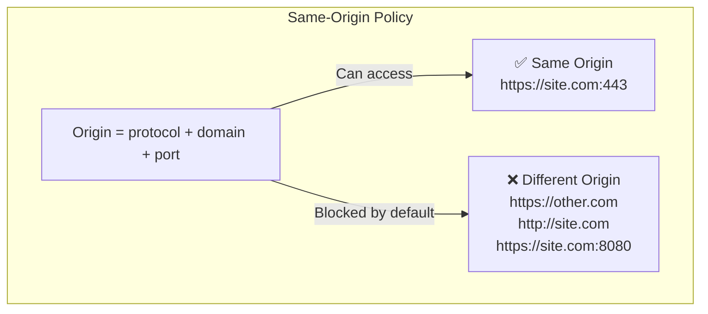
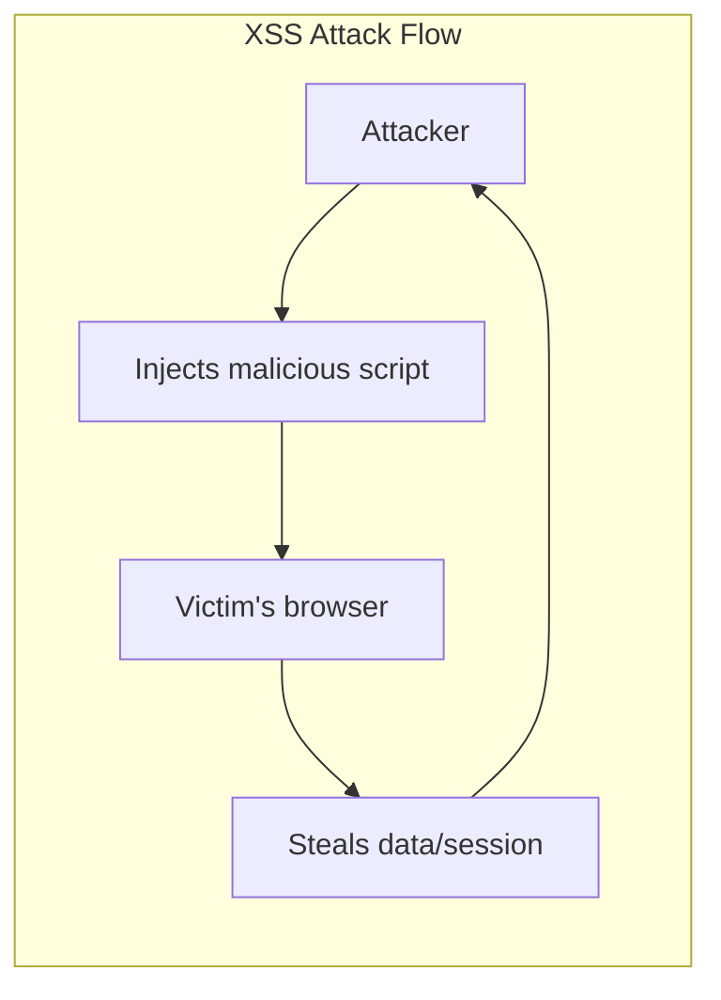

# ⚡ MODULE 7: PERFORMANCE & SECURITY

> **Focus**: 60% Theory - 40% Techniques
>
> _Hiểu nguyên lý để optimize đúng chỗ_

---

## 📋 Trong Module Này

1. [Core Web Vitals Theory](#1-core-web-vitals-theory)
2. [Bundle Optimization](#2-bundle-optimization)
3. [Runtime Performance](#3-runtime-performance)
4. [Security Mental Model](#4-security-mental-model)
5. [Common Vulnerabilities](#5-common-vulnerabilities)

---

## 1. Core Web Vitals Theory

### ❓ WHAT - Core Web Vitals là gì?



### 🔍 HOW - Đo lường gì?

| Metric  | Measures                      | User Experience        |
| ------- | ----------------------------- | ---------------------- |
| **LCP** | Load time of largest element  | "Is it loading?"       |
| **INP** | Response time to interactions | "Is it responsive?"    |
| **CLS** | Visual stability              | "Does it jump around?" |

### 💡 WHY - Optimization Strategies

```
┌────────────────────────────────────────────────────────────┐
│  LCP OPTIMIZATION                                          │
│                                                            │
│  Root causes:                                               │
│  • Slow server response (TTFB)                             │
│  • Render-blocking resources                               │
│  • Slow resource load (images, fonts)                      │
│  • Client-side rendering                                    │
│                                                            │
│  Solutions:                                                 │
│  ✓ Use SSR/SSG for critical content                        │
│  ✓ Preload critical resources                              │
│  ✓ Optimize images (next/image, WebP)                      │
│  ✓ Use CDN                                                  │
│  ✓ Inline critical CSS                                      │
└────────────────────────────────────────────────────────────┘

┌────────────────────────────────────────────────────────────┐
│  INP OPTIMIZATION                                          │
│                                                            │
│  Root causes:                                               │
│  • Long JavaScript tasks                                    │
│  • Heavy main thread work                                   │
│  • Large DOM                                                │
│                                                            │
│  Solutions:                                                 │
│  ✓ Break up long tasks (yield to main thread)              │
│  ✓ Use Web Workers for heavy computation                   │
│  ✓ Defer non-critical JavaScript                           │
│  ✓ Virtualize long lists                                    │
└────────────────────────────────────────────────────────────┘

┌────────────────────────────────────────────────────────────┐
│  CLS OPTIMIZATION                                          │
│                                                            │
│  Root causes:                                               │
│  • Images without dimensions                               │
│  • Ads, embeds without size                                │
│  • Dynamic content injection                               │
│  • Web fonts causing FOUT                                   │
│                                                            │
│  Solutions:                                                 │
│  ✓ Always set width/height on images                       │
│  ✓ Reserve space for dynamic content                       │
│  ✓ Use font-display: swap with size-adjust                 │
│  ✓ Prefer transform over top/left for animations          │
└────────────────────────────────────────────────────────────┘
```

---

## 2. Bundle Optimization

### Tree Shaking

**What**: Remove unused code at build time

```
┌────────────────────────────────────────────────────────────┐
│  // utils.js                                               │
│  export function used() { ... }    ✅ Included            │
│  export function unused() { ... }  ❌ Removed             │
│                                                            │
│  // app.js                                                 │
│  import { used } from './utils';                          │
│                                                            │
│  💡 Requirements for tree shaking:                         │
│     • Use ES Modules (import/export)                       │
│     • No side effects in module scope                      │
│     • Mark "sideEffects": false in package.json            │
└────────────────────────────────────────────────────────────┘
```

### Code Splitting



**Strategies:**
| Strategy | When | How |
|----------|------|-----|
| **Route-based** | Different pages | `React.lazy()`, dynamic imports |
| **Component-based** | Heavy components | Load on visibility |
| **Vendor split** | Third-party libs | Webpack splitChunks |

### Lazy Loading

```
┌────────────────────────────────────────────────────────────┐
│  LAZY LOADING DECISION                                     │
│                                                            │
│  Eager load: Critical path, above-the-fold                 │
│  Lazy load: Below-fold, rarely used, heavy                 │
│                                                            │
│  // Route level                                            │
│  const Dashboard = lazy(() => import('./Dashboard'));     │
│                                                            │
│  // Component level                                        │
│  const Chart = lazy(() => import('./Chart'));             │
│                                                            │
│  // Image level                                            │
│                                      │
└────────────────────────────────────────────────────────────┘
```

---

## 3. Runtime Performance

### React Re-render Optimization



**When to optimize:**

```
┌────────────────────────────────────────────────────────────┐
│  DON'T OPTIMIZE PREMATURELY                                │
│                                                            │
│  Premature optimization = root of all evil                 │
│                                                            │
│  OPTIMIZE WHEN:                                            │
│  1. You've measured actual performance issue               │
│  2. React DevTools shows unnecessary re-renders            │
│  3. User experiences noticeable lag                        │
│                                                            │
│  DON'T OPTIMIZE:                                           │
│  1. Component renders fast anyway                          │
│  2. Props/state change rarely                              │
│  3. "Just in case"                                         │
└────────────────────────────────────────────────────────────┘
```

### Memory Leaks Prevention

| Leak Source         | Prevention                                |
| ------------------- | ----------------------------------------- |
| **Event listeners** | Clean up in useEffect return              |
| **Timers**          | clearTimeout/clearInterval in cleanup     |
| **Subscriptions**   | Unsubscribe on unmount                    |
| **Closures**        | Don't capture large objects unnecessarily |
| **DOM references**  | Nullify refs on unmount                   |

---

## 4. Security Mental Model

### Same-Origin Policy



### CORS Explained

```
┌────────────────────────────────────────────────────────────┐
│  CORS = Cross-Origin Resource Sharing                      │
│                                                            │
│  Problem: SOP blocks cross-origin requests                 │
│  Solution: Server explicitly allows certain origins        │
│                                                            │
│  How it works:                                             │
│  1. Browser sends request with Origin header               │
│  2. Server responds with Access-Control-Allow-Origin       │
│  3. If origin matches, browser allows response             │
│                                                            │
│  Preflight (OPTIONS):                                      │
│  - For "complex" requests (PUT, DELETE, custom headers)    │
│  - Browser asks permission first                           │
│  - Server must respond with allowed methods/headers        │
└────────────────────────────────────────────────────────────┘
```

---

## 5. Common Vulnerabilities

### XSS (Cross-Site Scripting)



**Prevention:**
| Attack Vector | Prevention |
|---------------|------------|
| **innerHTML** | Use textContent instead |
| **User input in HTML** | Sanitize, encode |
| **URL params in page** | Validate, encode |
| **React** | Auto-escapes by default ✅ |
| **dangerouslySetInnerHTML** | Sanitize with DOMPurify |

### CSRF (Cross-Site Request Forgery)

```
┌────────────────────────────────────────────────────────────┐
│  CSRF Attack:                                              │
│  1. User logs into bank.com (has session cookie)          │
│  2. User visits evil.com                                   │
│  3. evil.com makes request to bank.com/transfer           │
│  4. Browser attaches bank.com cookies automatically!       │
│  5. Bank thinks it's legitimate request                    │
│                                                            │
│  Prevention:                                               │
│  • CSRF tokens (server validates token in request)         │
│  • SameSite cookies (block cross-origin cookie sending)   │
│  • Check Origin/Referer headers                           │
└────────────────────────────────────────────────────────────┘
```

### Security Headers

| Header                        | Purpose                   |
| ----------------------------- | ------------------------- |
| **Content-Security-Policy**   | Control allowed resources |
| **X-Frame-Options**           | Prevent clickjacking      |
| **X-Content-Type-Options**    | Prevent MIME sniffing     |
| **Strict-Transport-Security** | Force HTTPS               |

---

## 📊 Summary

| Category     | Key Points                                   |
| ------------ | -------------------------------------------- |
| **LCP**      | SSR, preload, optimize images, CDN           |
| **INP**      | Break long tasks, Web Workers, defer JS      |
| **CLS**      | Reserve space, size attributes, font-display |
| **Bundle**   | Tree shake, code split, lazy load            |
| **Security** | CORS, SameSite cookies, CSP, escape output   |

---

## 🔗 Navigation

| Prev                                             | Module                        | Next                                       |
| ------------------------------------------------ | ----------------------------- | ------------------------------------------ |
| [Framework Patterns](./06-framework-patterns.md) | **7. Performance & Security** | [Testing & DevOps](./08-testing-devops.md) |

---

> _Tiếp theo: [Module 8: Testing & DevOps](./08-testing-devops.md)_
