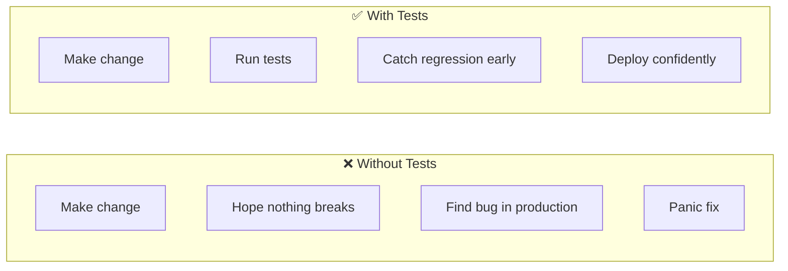
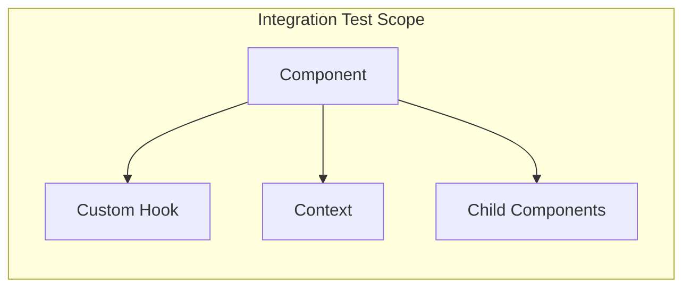
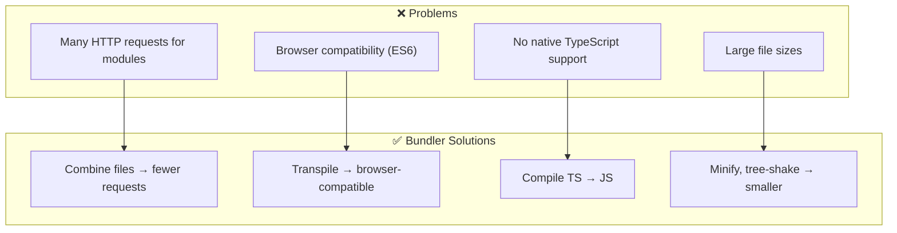
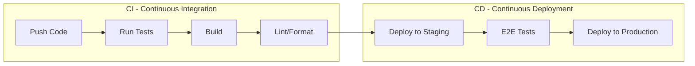
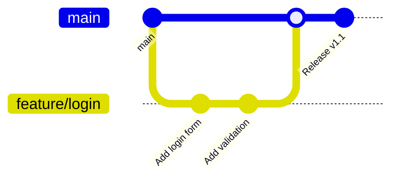

# 🛠️ MODULE 8: TESTING & DEVOPS

> **Focus**: 50% Theory - 50% Practice
>
> _Testing philosophy và workflow hiệu quả_

---

## 📋 Trong Module Này

1. [Testing Philosophy](#1-testing-philosophy)
2. [Testing Types](#2-testing-types)
3. [Build Tools Theory](#3-build-tools-theory)
4. [CI/CD Philosophy](#4-cicd-philosophy)

---

## 1. Testing Philosophy

### ❓ WHAT - Tại sao cần test?



### 💡 WHY - Testing Pyramid

```
           /\
          /E2E\          5-10%  Slow, Expensive
         /──────\
        /Integration\    20-30% Medium
       /──────────────\
      /    Unit Tests  \  60-70% Fast, Cheap
     /──────────────────\
```

| Level           | Scope                        | Speed     | Confidence      |
| --------------- | ---------------------------- | --------- | --------------- |
| **Unit**        | Single function/component    | ⚡ Fast   | Isolated        |
| **Integration** | Multiple components together | 🔄 Medium | Interactions    |
| **E2E**         | Full user flow               | 🐢 Slow   | Closest to real |

### What to Test?

```
┌────────────────────────────────────────────────────────────┐
│  TESTING DECISION MATRIX                                   │
│                                                            │
│  TEST:                                                     │
│  ✓ User interactions (click, type, submit)                 │
│  ✓ Conditional rendering                                   │
│  ✓ Business logic                                          │
│  ✓ Edge cases and error states                             │
│  ✓ Accessibility (role, aria)                              │
│                                                            │
│  DON'T TEST:                                               │
│  ✗ Implementation details                                  │
│  ✗ Third-party libraries                                   │
│  ✗ Framework internals                                     │
│  ✗ Styling/CSS (unless critical)                           │
└────────────────────────────────────────────────────────────┘
```

---

## 2. Testing Types

### Unit Testing

**Philosophy**: Test in isolation, mock dependencies

```
┌────────────────────────────────────────────────────────────┐
│  GOOD UNIT TEST = FAST + ISOLATED + FOCUSED                │
│                                                            │
│  AAA Pattern:                                              │
│  - Arrange: Set up test data                               │
│  - Act: Execute the action                                 │
│  - Assert: Verify the result                               │
│                                                            │
│  Naming: "should [expected] when [condition]"              │
│  Example: "should disable button when form is invalid"     │
└────────────────────────────────────────────────────────────┘
```

### Integration Testing

**Philosophy**: Test components working together



### E2E Testing

**Philosophy**: Test from user's perspective

| Tool           | Best For                     | Speed |
| -------------- | ---------------------------- | ----- |
| **Cypress**    | Component + E2E, great DX    | Fast  |
| **Playwright** | Cross-browser, parallel      | Fast  |
| **Selenium**   | Legacy, wide browser support | Slow  |

### Testing Library Philosophy

```
┌────────────────────────────────────────────────────────────┐
│  "The more your tests resemble the way your software is   │
│   used, the more confidence they can give you."            │
│                                    — Testing Library       │
│                                                            │
│  QUERY PRIORITY:                                           │
│  1. getByRole          ← Screen readers use               │
│  2. getByLabelText     ← Form fields                       │
│  3. getByPlaceholderText                                   │
│  4. getByText          ← Visible text                      │
│  5. getByTestId        ← Last resort                       │
│                                                            │
│  AVOID:                                                    │
│  ✗ getByClassName                                          │
│  ✗ querySelector                                           │
│  ✗ Testing implementation details                          │
└────────────────────────────────────────────────────────────┘
```

---

## 3. Build Tools Theory

### Why Bundlers Exist



### Vite vs Webpack

| Aspect         | Webpack                  | Vite                  |
| -------------- | ------------------------ | --------------------- |
| **Dev server** | Bundle first, then serve | Native ESM, no bundle |
| **HMR**        | Rebuild chunk            | Instant               |
| **Config**     | Complex                  | Simpler               |
| **Build**      | Webpack                  | Rollup                |
| **Best for**   | Complex enterprise       | Modern apps           |

### Why Vite is Fast

```
┌────────────────────────────────────────────────────────────┐
│  WEBPACK (Traditional)                                     │
│                                                            │
│  Start: Bundle all files → then serve                      │
│         [──────────────────] → Ready                       │
│                                                            │
│  VITE (Modern)                                             │
│                                                            │
│  Start: Serve immediately (use native ESM)                 │
│         [─] → Ready (transform on-demand)                  │
│                                                            │
│  Why?                                                      │
│  • Browsers now support ES Modules natively                │
│  • Only transform what browser requests                    │
│  • esbuild (Go) for pre-bundling deps (10-100x faster)     │
└────────────────────────────────────────────────────────────┘
```

---

## 4. CI/CD Philosophy

### What is CI/CD?



### Key Principles

| Principle                   | Why                      |
| --------------------------- | ------------------------ |
| **Automate everything**     | Reduce human error       |
| **Fail fast**               | Catch issues early       |
| **Keep builds fast**        | Developer productivity   |
| **Trunk-based development** | Small, frequent merges   |
| **Feature flags**           | Deploy without releasing |

### CI/CD Pipeline Stages

```
┌────────────────────────────────────────────────────────────┐
│  TYPICAL CI PIPELINE                                       │
│                                                            │
│  1. CHECKOUT                                               │
│     • Shallow clone for speed                              │
│                                                            │
│  2. INSTALL                                                │
│     • Cache node_modules                                   │
│                                                            │
│  3. LINT                                                   │
│     • ESLint, TypeScript, Prettier                         │
│                                                            │
│  4. TEST                                                   │
│     • Unit tests with coverage                             │
│                                                            │
│  5. BUILD                                                  │
│     • Production build                                     │
│                                                            │
│  6. DEPLOY                                                 │
│     • Preview deployment for PRs                           │
│     • Production for main branch                           │
└────────────────────────────────────────────────────────────┘
```

### Git Workflow



**Conventional Commits:**

```
feat: Add login page
fix: Resolve button click issue
docs: Update README
refactor: Extract validation logic
test: Add unit tests for auth
chore: Update dependencies
```

---

## 📊 Summary

| Topic               | Key Takeaway                        |
| ------------------- | ----------------------------------- |
| **Testing Pyramid** | More unit tests, fewer E2E          |
| **Testing Library** | Query like user sees                |
| **Bundlers**        | Vite for speed, Webpack for control |
| **CI/CD**           | Automate, fail fast, deploy often   |
| **Git**             | Small PRs, conventional commits     |

---

## 🔗 Navigation

| Prev                                                   | Module                  | Next                                       |
| ------------------------------------------------------ | ----------------------- | ------------------------------------------ |
| [Performance & Security](./07-performance-security.md) | **8. Testing & DevOps** | [Coding Practice](./09-coding-practice.md) |

---

> _Tiếp theo: [Module 9: Coding Practice](./09-coding-practice.md)_
