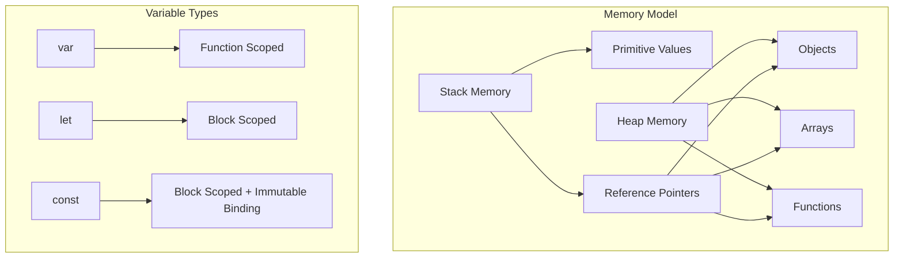
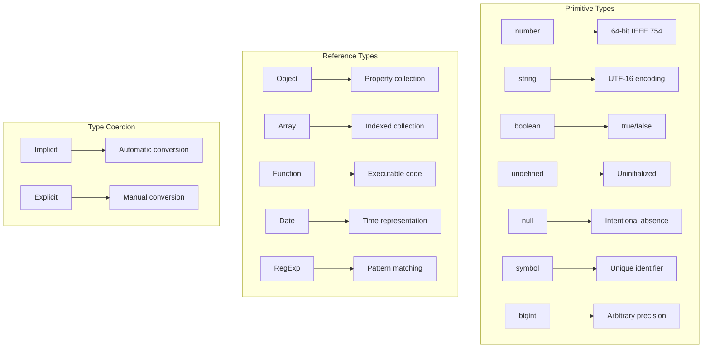
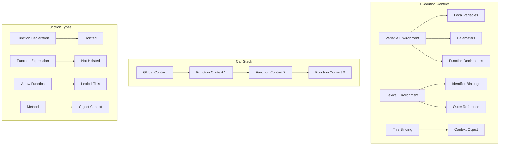
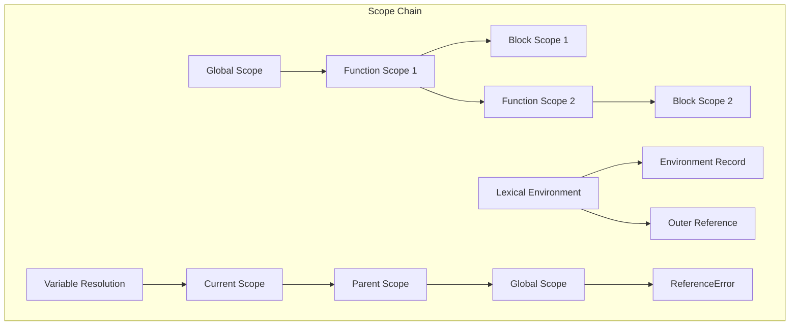
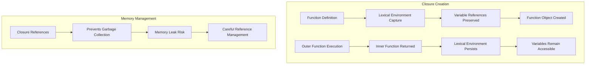
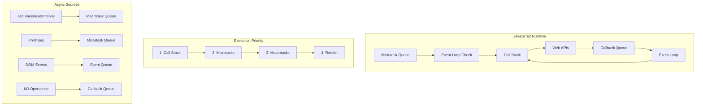
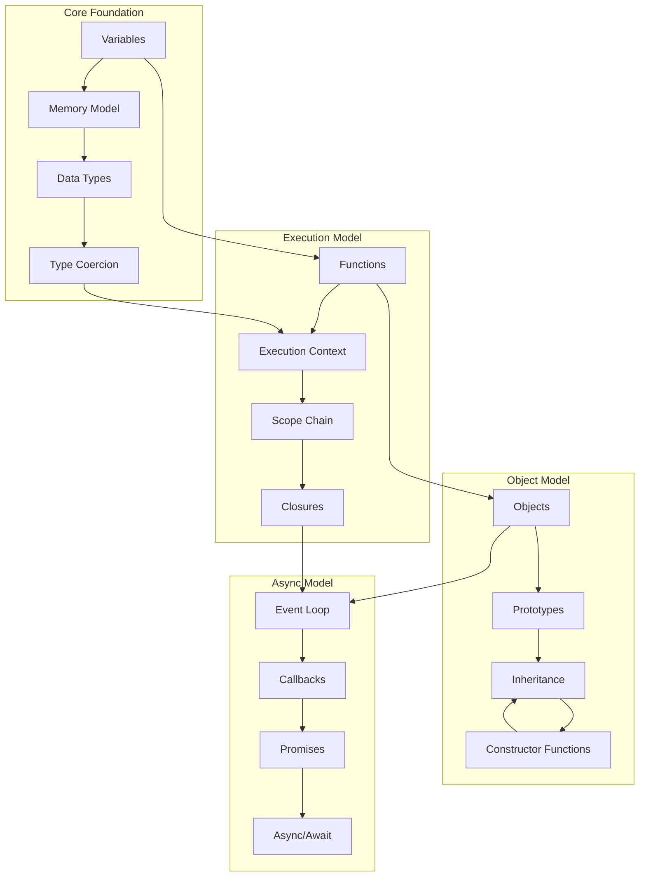

# JavaScript Fundamentals Theory - Deep Conceptual Understanding / Lý thuyết JavaScript cơ bản - Hiểu biết sâu về khái niệm

## 🧠 Core Concept Definitions & Interconnections / Định nghĩa khái niệm cốt lõi & Mối liên kết

---

*Ghi chú: Tài liệu này cung cấp kiến thức nền tảng JavaScript với định nghĩa chi tiết, ví dụ thực tế và mối liên kết giữa các khái niệm để chuẩn bị cho phỏng vấn kỹ thuật tại các công ty công nghệ hàng đầu.*

---

### 1. **Variables & Memory Model / Biến và Mô hình bộ nhớ**

#### **What is a Variable? / Biến là gì?**

**English Definition:** A variable is a named storage location that holds a reference to a value in memory.

**Định nghĩa (Tiếng Việt):** Biến là một vị trí lưu trữ có tên, chứa tham chiếu đến một giá trị trong bộ nhớ.

**Why Variables Exist / Tại sao có biến:**
- **Abstraction / Trừu tượng hóa**: Hide memory addresses from developers / Ẩn địa chỉ bộ nhớ khỏi lập trình viên
- **Reusability / Tái sử dụng**: Reference the same data multiple times / Tham chiếu cùng một dữ liệu nhiều lần
- **Mutability / Khả năng thay đổi**: Allow data to change over time / Cho phép dữ liệu thay đổi theo thời gian
- **Scope Management / Quản lý phạm vi**: Control data access and lifetime / Kiểm soát truy cập dữ liệu và vòng đời

**How Variables Work in JavaScript:**



**Deep Theory:**
```javascript
// WHAT: Variable declaration creates binding
let x; // Creates binding 'x' in current scope, value = undefined

// WHY: Memory allocation happens at different times
var a = 1;        // Hoisted, allocated at function start
let b = 2;        // Temporal dead zone until declaration
const c = 3;      // Must be initialized, immutable binding

// HOW: Different storage mechanisms
let primitive = 42;           // Stored directly in stack
let reference = { value: 42 }; // Pointer in stack, object in heap

// Memory implications
let obj1 = { data: 'hello' };
let obj2 = obj1;              // Copies reference, not object
obj2.data = 'world';          // Modifies shared object
console.log(obj1.data);       // 'world' - same object!
```

**Interconnected Concepts:**
- **Scope Chain**: How variables are resolved
- **Hoisting**: When variable bindings are created
- **Garbage Collection**: When variable memory is freed
- **Closures**: How variables are captured and preserved

### 2. **Data Types & Type System**

#### **What are Data Types?**
**Definition:** Data types define the kind of data a variable can hold and the operations that can be performed on it.

**Why Type System Matters:**
- **Memory Optimization**: Different types require different storage
- **Operation Safety**: Prevents invalid operations
- **Performance**: Enables engine optimizations
- **Developer Experience**: Provides predictable behavior

**JavaScript's Dual Type System:**



**Deep Theory with Examples:**
```javascript
// WHAT: Primitive vs Reference behavior
let a = 5;
let b = a;        // Copies value
a = 10;
console.log(b);   // Still 5

let obj1 = { x: 5 };
let obj2 = obj1;  // Copies reference
obj1.x = 10;
console.log(obj2.x); // 10 - same object

// WHY: Memory efficiency and performance
// Primitives: Small, fixed size, stack storage
// References: Variable size, heap storage, garbage collected

// HOW: Type checking and coercion
typeof 42;           // "number"
typeof "hello";      // "string"
typeof {};           // "object"
typeof null;         // "object" (historical bug)
typeof undefined;    // "undefined"

// Type coercion rules (complex but predictable)
"5" + 3;            // "53" (string concatenation)
"5" - 3;            // 2 (numeric subtraction)
true + 1;           // 2 (boolean to number)
[] + {};            // "[object Object]" (both to string)
```

**Interconnected Concepts:**
- **Type Coercion**: Automatic type conversion
- **Equality Operators**: == vs === behavior
- **Truthy/Falsy**: Boolean context evaluation
- **Boxing**: Primitive to object conversion

### 3. **Functions & Execution Context**

#### **What is a Function?**
**Definition:** A function is a reusable block of code that encapsulates logic, can accept parameters, and can return values.

**Why Functions are Fundamental:**
- **Code Reusability**: Write once, use many times
- **Abstraction**: Hide implementation details
- **Modularity**: Break complex problems into smaller parts
- **Scope Creation**: Create isolated execution environments

**How Functions Create Execution Context:**



**Deep Theory with Examples:**
```javascript
// WHAT: Different function creation methods
// Function Declaration - hoisted, can be called before definition
console.log(add(2, 3)); // Works! Returns 5

function add(a, b) {
    return a + b;
}

// Function Expression - not hoisted
console.log(multiply(2, 3)); // Error! Cannot access before initialization

const multiply = function(a, b) {
    return a * b;
};

// Arrow Function - lexical this binding
const obj = {
    name: 'Object',
    regularFunction: function() {
        console.log(this.name); // 'Object'
        
        const arrowFunction = () => {
            console.log(this.name); // 'Object' (inherited from outer)
        };
        
        function innerFunction() {
            console.log(this.name); // undefined (new context)
        }
        
        arrowFunction();
        innerFunction();
    }
};

// WHY: Execution context creation
function outer(x) {
    let outerVar = 'outer';
    
    function inner(y) {
        let innerVar = 'inner';
        console.log(x, y, outerVar, innerVar); // Access to all scopes
    }
    
    return inner;
}

const closureFunction = outer('param');
closureFunction('arg'); // "param arg outer inner"

// HOW: Scope chain resolution
// 1. Check current execution context
// 2. Check outer lexical environment
// 3. Continue up scope chain
// 4. Reach global scope
// 5. ReferenceError if not found
```

**Interconnected Concepts:**
- **Closures**: Functions retaining access to outer scope
- **Hoisting**: Function declarations vs expressions
- **This Binding**: Context determination rules
- **Call Stack**: Function execution order

### 4. **Scope & Lexical Environment**

#### **What is Scope?**
**Definition:** Scope determines the accessibility and lifetime of variables and functions in different parts of code.

**Why Scope Exists:**
- **Name Collision Prevention**: Same variable names in different contexts
- **Memory Management**: Variables can be garbage collected when out of scope
- **Encapsulation**: Hide implementation details
- **Predictable Behavior**: Clear rules for variable access

**How Lexical Scoping Works:**



**Deep Theory with Examples:**
```javascript
// WHAT: Different scope types
var globalVar = 'global';           // Global scope
let globalLet = 'global let';       // Global scope

function outerFunction() {
    var functionVar = 'function';   // Function scope
    let functionLet = 'function let'; // Function scope
    
    if (true) {
        var blockVar = 'block var';     // Function scope (var ignores blocks)
        let blockLet = 'block let';     // Block scope
        const blockConst = 'block const'; // Block scope
        
        console.log(blockLet); // Accessible here
    }
    
    console.log(blockVar);  // Accessible (var is function-scoped)
    console.log(blockLet);  // ReferenceError (let is block-scoped)
}

// WHY: Lexical scoping (determined at compile time)
function createCounter() {
    let count = 0;
    
    return function() {
        count++; // Accesses outer variable
        return count;
    };
}

const counter1 = createCounter();
const counter2 = createCounter();

console.log(counter1()); // 1
console.log(counter1()); // 2
console.log(counter2()); // 1 (separate closure)

// HOW: Scope chain traversal
let x = 'global x';

function level1() {
    let x = 'level1 x';
    
    function level2() {
        let x = 'level2 x';
        
        function level3() {
            // Variable resolution:
            // 1. Check level3 scope - no 'x'
            // 2. Check level2 scope - found 'x'
            console.log(x); // 'level2 x'
        }
        
        level3();
    }
    
    level2();
}

level1();
```

**Interconnected Concepts:**
- **Closures**: Scope preservation after function returns
- **Hoisting**: Variable and function scope behavior
- **Temporal Dead Zone**: let/const accessibility rules
- **Module Pattern**: Scope-based encapsulation

### 5. **Closures & Lexical Environment Preservation**

#### **What is a Closure?**
**Definition:** A closure is a function that retains access to variables from its outer (enclosing) scope even after the outer function has returned.

**Why Closures are Powerful:**
- **Data Privacy**: Create private variables
- **State Persistence**: Maintain state between function calls
- **Callback Patterns**: Preserve context in asynchronous operations
- **Module Pattern**: Encapsulate functionality

**How Closures Work Internally:**



**Deep Theory with Examples:**
```javascript
// WHAT: Basic closure mechanism
function createGreeter(name) {
    // This variable will be captured in closure
    const greeting = `Hello, ${name}!`;
    
    // Inner function has access to outer scope
    return function() {
        console.log(greeting); // Accesses 'greeting' from outer scope
    };
}

const greetJohn = createGreeter('John');
greetJohn(); // "Hello, John!" - 'greeting' still accessible

// WHY: Practical applications
// 1. Data Privacy
function createBankAccount(initialBalance) {
    let balance = initialBalance; // Private variable
    
    return {
        deposit(amount) {
            balance += amount;
            return balance;
        },
        withdraw(amount) {
            if (amount <= balance) {
                balance -= amount;
                return balance;
            }
            throw new Error('Insufficient funds');
        },
        getBalance() {
            return balance; // Controlled access
        }
        // No direct access to 'balance' variable
    };
}

const account = createBankAccount(100);
console.log(account.getBalance()); // 100
account.deposit(50);               // 150
// account.balance = 1000000;      // Cannot access directly!

// 2. Callback Context Preservation
function setupEventHandlers() {
    const data = { count: 0 };
    
    document.getElementById('button').addEventListener('click', function() {
        data.count++; // Closure preserves access to 'data'
        console.log(`Clicked ${data.count} times`);
    });
}

// 3. Module Pattern
const Calculator = (function() {
    // Private variables and functions
    let result = 0;
    
    function log(operation, value) {
        console.log(`${operation}: ${value}, Result: ${result}`);
    }
    
    // Public API
    return {
        add(value) {
            result += value;
            log('Add', value);
            return this;
        },
        subtract(value) {
            result -= value;
            log('Subtract', value);
            return this;
        },
        getResult() {
            return result;
        },
        reset() {
            result = 0;
            log('Reset', 0);
            return this;
        }
    };
})();

Calculator.add(10).subtract(3).add(5); // Method chaining
console.log(Calculator.getResult()); // 12

// HOW: Memory implications
function createFunctions() {
    const functions = [];
    
    // Common mistake - all functions share same 'i'
    for (var i = 0; i < 3; i++) {
        functions.push(function() {
            console.log(i); // All will log 3!
        });
    }
    
    return functions;
}

// Correct approach - create separate closure for each
function createFunctionsCorrect() {
    const functions = [];
    
    for (let i = 0; i < 3; i++) { // 'let' creates new binding each iteration
        functions.push(function() {
            console.log(i); // Each logs its own 'i'
        });
    }
    
    return functions;
}

// Alternative with IIFE
function createFunctionsIIFE() {
    const functions = [];
    
    for (var i = 0; i < 3; i++) {
        functions.push((function(index) {
            return function() {
                console.log(index); // Captures 'index' parameter
            };
        })(i));
    }
    
    return functions;
}
```

**Interconnected Concepts:**
- **Lexical Scoping**: Foundation for closure behavior
- **Memory Management**: Closure impact on garbage collection
- **Event Handling**: Context preservation in callbacks
- **Module Systems**: Encapsulation patterns

### 6. **Prototypes & Inheritance Chain**

#### **What is the Prototype System?**
**Definition:** JavaScript's prototype system is a mechanism for object inheritance where objects can inherit properties and methods from other objects.

**Why Prototypes Instead of Classes:**
- **Dynamic Inheritance**: Objects can change their prototype chain at runtime
- **Memory Efficiency**: Methods shared across instances
- **Flexibility**: Multiple inheritance patterns possible
- **JavaScript's Nature**: Fits the dynamic, object-based language design

**How Prototype Chain Works:**

```mermaid
graph TB
    subgraph "Prototype Chain"
        A[Object Instance] --> B[Constructor.prototype]
        B --> C[Object.prototype]
        C --> D[null]
        
        E[Property Lookup] --> F[Own Properties]
        F --> G[Prototype Properties]
        G --> H[Prototype's Prototype]
        H --> I[Continue Up Chain]
        I --> J[undefined if not found]
    end

    subgraph "Constructor Function"
        K[Function Definition] --> L[Prototype Property]
        L --> M[Constructor Property]
        M --> N[Shared Methods]
    end

    subgraph "Class Syntax (ES6+)"
        O[Class Declaration] --> P[Constructor Method]
        P --> Q[Instance Methods]
        Q --> R[Static Methods]
    end
```



**Deep Theory with Examples:**
```javascript
// WHAT: Prototype-based inheritance
function Animal(name) {
    this.name = name;
}

// Methods on prototype are shared
Animal.prototype.speak = function() {
    console.log(`${this.name} makes a sound`);
};

Animal.prototype.eat = function() {
    console.log(`${this.name} is eating`);
};

function Dog(name, breed) {
    Animal.call(this, name); // Call parent constructor
    this.breed = breed;
}

// Set up inheritance
Dog.prototype = Object.create(Animal.prototype);
Dog.prototype.constructor = Dog;

// Add dog-specific methods
Dog.prototype.bark = function() {
    console.log(`${this.name} barks: Woof!`);
};

// Override parent method
Dog.prototype.speak = function() {
    this.bark();
};

const dog = new Dog('Rex', 'German Shepherd');
dog.speak(); // "Rex barks: Woof!"
dog.eat();   // "Rex is eating" (inherited)

// WHY: Memory efficiency demonstration
function Person(name) {
    this.name = name;
    
    // BAD: Each instance gets its own copy
    this.greet = function() {
        console.log(`Hello, I'm ${this.name}`);
    };
}

function PersonOptimized(name) {
    this.name = name;
}

// GOOD: Shared across all instances
PersonOptimized.prototype.greet = function() {
    console.log(`Hello, I'm ${this.name}`);
};

const person1 = new PersonOptimized('Alice');
const person2 = new PersonOptimized('Bob');

console.log(person1.greet === person2.greet); // true - same function

// HOW: Prototype chain traversal
const obj = {
    prop1: 'value1'
};

console.log(obj.prop1);        // 'value1' (own property)
console.log(obj.toString);     // function (from Object.prototype)
console.log(obj.hasOwnProperty); // function (from Object.prototype)
console.log(obj.nonExistent);  // undefined (not found in chain)

// Modern class syntax (syntactic sugar over prototypes)
class ModernAnimal {
    constructor(name) {
        this.name = name;
    }
    
    speak() {
        console.log(`${this.name} makes a sound`);
    }
    
    static getSpecies() {
        return 'Unknown species';
    }
}

class ModernDog extends ModernAnimal {
    constructor(name, breed) {
        super(name); // Call parent constructor
        this.breed = breed;
    }
    
    speak() {
        console.log(`${this.name} barks: Woof!`);
    }
    
    static getSpecies() {
        return 'Canis lupus';
    }
}

// Under the hood, this creates the same prototype chain
const modernDog = new ModernDog('Buddy', 'Golden Retriever');
console.log(modernDog instanceof ModernDog);    // true
console.log(modernDog instanceof ModernAnimal); // true
console.log(modernDog instanceof Object);       // true
```

**Interconnected Concepts:**
- **Constructor Functions**: Object creation patterns
- **instanceof Operator**: Prototype chain checking
- **Object.create()**: Direct prototype setting
- **Class Syntax**: Modern inheritance syntax

### 7. **Asynchronous JavaScript & Event Loop**

#### **What is Asynchronous Programming?**
**Definition:** Asynchronous programming allows code execution to continue without waiting for long-running operations to complete.

**Why Asynchronous Programming is Essential:**
- **Non-blocking UI**: Keep user interface responsive
- **I/O Operations**: Handle network requests, file operations
- **Performance**: Utilize waiting time for other tasks
- **Scalability**: Handle multiple operations concurrently

**How Event Loop Orchestrates Execution:**



**Deep Theory with Examples:**
```javascript
// WHAT: Event loop execution order
console.log('1'); // Synchronous

setTimeout(() => console.log('2'), 0); // Macrotask

Promise.resolve().then(() => console.log('3')); // Microtask

queueMicrotask(() => console.log('4')); // Microtask

console.log('5'); // Synchronous

// Output: 1, 5, 3, 4, 2
// Explanation:
// 1. Synchronous code executes first (1, 5)
// 2. Microtasks execute before macrotasks (3, 4)
// 3. Macrotasks execute last (2)

// WHY: Asynchronous patterns evolution
// 1. Callbacks (Callback Hell)
function fetchUserData(userId, callback) {
    setTimeout(() => {
        const user = { id: userId, name: 'John' };
        callback(null, user);
    }, 1000);
}

function fetchUserPosts(userId, callback) {
    setTimeout(() => {
        const posts = [{ id: 1, title: 'Post 1' }];
        callback(null, posts);
    }, 1000);
}

// Callback hell
fetchUserData(1, (err, user) => {
    if (err) throw err;
    fetchUserPosts(user.id, (err, posts) => {
        if (err) throw err;
        console.log('User:', user, 'Posts:', posts);
    });
});

// 2. Promises (Better error handling and chaining)
function fetchUserDataPromise(userId) {
    return new Promise((resolve, reject) => {
        setTimeout(() => {
            const user = { id: userId, name: 'John' };
            resolve(user);
        }, 1000);
    });
}

function fetchUserPostsPromise(userId) {
    return new Promise((resolve, reject) => {
        setTimeout(() => {
            const posts = [{ id: 1, title: 'Post 1' }];
            resolve(posts);
        }, 1000);
    });
}

// Promise chaining
fetchUserDataPromise(1)
    .then(user => {
        console.log('User:', user);
        return fetchUserPostsPromise(user.id);
    })
    .then(posts => {
        console.log('Posts:', posts);
    })
    .catch(err => {
        console.error('Error:', err);
    });

// 3. Async/Await (Synchronous-looking asynchronous code)
async function fetchUserDataAndPosts(userId) {
    try {
        const user = await fetchUserDataPromise(userId);
        console.log('User:', user);
        
        const posts = await fetchUserPostsPromise(user.id);
        console.log('Posts:', posts);
        
        return { user, posts };
    } catch (err) {
        console.error('Error:', err);
        throw err;
    }
}

// HOW: Promise internals and states
class SimplePromise {
    constructor(executor) {
        this.state = 'pending';
        this.value = undefined;
        this.handlers = [];
        
        const resolve = (value) => {
            if (this.state === 'pending') {
                this.state = 'fulfilled';
                this.value = value;
                this.handlers.forEach(handler => handler.onFulfilled(value));
            }
        };
        
        const reject = (reason) => {
            if (this.state === 'pending') {
                this.state = 'rejected';
                this.value = reason;
                this.handlers.forEach(handler => handler.onRejected(reason));
            }
        };
        
        try {
            executor(resolve, reject);
        } catch (err) {
            reject(err);
        }
    }
    
    then(onFulfilled, onRejected) {
        return new SimplePromise((resolve, reject) => {
            const handler = {
                onFulfilled: (value) => {
                    try {
                        const result = onFulfilled ? onFulfilled(value) : value;
                        resolve(result);
                    } catch (err) {
                        reject(err);
                    }
                },
                onRejected: (reason) => {
                    try {
                        const result = onRejected ? onRejected(reason) : reason;
                        reject(result);
                    } catch (err) {
                        reject(err);
                    }
                }
            };
            
            if (this.state === 'fulfilled') {
                handler.onFulfilled(this.value);
            } else if (this.state === 'rejected') {
                handler.onRejected(this.value);
            } else {
                this.handlers.push(handler);
            }
        });
    }
}

// Advanced async patterns
// Parallel execution
async function fetchMultipleUsers(userIds) {
    const promises = userIds.map(id => fetchUserDataPromise(id));
    const users = await Promise.all(promises);
    return users;
}

// Race condition handling
async function fetchWithTimeout(promise, timeout) {
    const timeoutPromise = new Promise((_, reject) => {
        setTimeout(() => reject(new Error('Timeout')), timeout);
    });
    
    return Promise.race([promise, timeoutPromise]);
}

// Sequential execution with error recovery
async function fetchUsersSequentially(userIds) {
    const results = [];
    
    for (const id of userIds) {
        try {
            const user = await fetchUserDataPromise(id);
            results.push({ success: true, data: user });
        } catch (err) {
            results.push({ success: false, error: err.message });
        }
    }
    
    return results;
}
```

**Interconnected Concepts:**
- **Call Stack**: Synchronous execution context
- **Web APIs**: Browser-provided asynchronous capabilities
- **Callback Queue**: Macrotask scheduling
- **Microtask Queue**: Promise and queueMicrotask scheduling

## 🔗 Knowledge Integration Map

### **How Concepts Interconnect:**



### **Interview Success Framework:**

1. **Start with Definitions**: Always begin with clear, precise definitions
2. **Explain the Why**: Understand the reasoning behind language design decisions
3. **Show the How**: Demonstrate with practical, meaningful examples
4. **Connect Concepts**: Link related topics to show deep understanding
5. **Discuss Trade-offs**: Analyze pros/cons of different approaches

### **Common Interview Patterns:**

- **"Explain X"**: Definition → Why it exists → How it works → Examples
- **"What's the difference between X and Y"**: Compare/contrast with use cases
- **"How would you implement X"**: Show understanding of underlying mechanisms
- **"What happens when..."**: Trace through execution step by step
- **"Why would you use X over Y"**: Discuss trade-offs and appropriate contexts

This theoretical foundation provides the deep understanding necessary for advanced JavaScript interviews at top-tier companies.