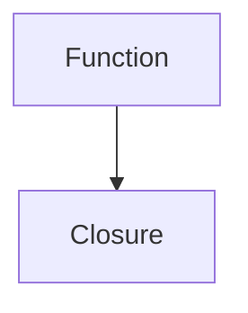

# Content Migration Quick Start Guide

This guide will walk you through migrating existing content from `docs/` to the new bilingual MDX structure.

## Prerequisites

1. Ensure you have Node.js and npm installed
2. Install dependencies:
   ```bash
   npm install
   ```

## Quick Start

Run the complete migration in one command:

```bash
npm run migrate:all
```

This will:
1. Convert all markdown files to MDX
2. Update prerequisites and related topics
3. Validate the migration

## Step-by-Step Migration

If you prefer to run each step individually:

### Step 1: Migrate Content

```bash
npm run migrate:content
```

**What it does:**
- Converts `docs/**/*.md` files to MDX format
- Generates metadata for each file
- Creates parallel English (`content/en/`) and Vietnamese (`content/vi/`) structures
- Updates internal links
- Generates `migration-mapping.json` and `link-validation-report.json`

**Expected output:**
```
🚀 Starting content migration...

📄 Found 150 markdown files to migrate

✓ Migrated: docs/01-javascript-fundamentals/03-closures.md -> content/en/javascript/closures.mdx
✓ Migrated: docs/02-typescript/01-typescript-basics.md -> content/en/typescript/typescript-basics.mdx
...

✓ Migrated 150 files

✓ Saved migration mapping to scripts/migration-mapping.json

🔗 Updating internal links...

✓ Updated 45 links

🔍 Validating links...

✓ Valid links: 420
✗ Broken links: 8

✓ Saved link validation report to scripts/link-validation-report.json

✅ Migration complete!
```

### Step 2: Update Prerequisites

```bash
npm run migrate:update-prerequisites
```

**What it does:**
- Analyzes content relationships
- Infers prerequisites based on difficulty and references
- Infers related topics based on tags and content similarity
- Updates metadata in both English and Vietnamese files

**Expected output:**
```
🔗 Updating prerequisites and related topics...

📄 Found 150 files

✓ Loaded 150 content files

🔍 Analyzing content references...

📝 Updating metadata...

✓ Updated: content/en/javascript/closures.mdx
  Prerequisites: 2
  Related topics: 5
...

✅ Updated 120 files
```

### Step 3: Validate Migration

```bash
npm run migrate:validate
```

**What it does:**
- Validates metadata schema compliance
- Checks internal link integrity
- Validates content structure
- Checks bilingual consistency
- Generates `validation-report.json`

**Expected output:**
```
🔍 Starting migration validation...

📄 Found 150 English files
📄 Found 150 Vietnamese files

✓ content/en/javascript/closures.mdx
⚠ content/en/javascript/async.mdx
  - [Bilingual] Vietnamese title not translated
✗ content/en/react/hooks.mdx
  - [Metadata] Missing required field: estimatedTime
  - [Links] Broken link: ../typescript/types.mdx

📊 Validation Summary:
Total files: 300
Valid files: 285 (95%)
Invalid files: 15 (5%)

Error breakdown:
  Metadata errors: 5
  Link errors: 8
  Structure errors: 2
  Bilingual errors: 10

✓ Saved validation report to scripts/validation-report.json
```

## Review Generated Files

After migration, review these files:

### 1. migration-mapping.json

Contains the mapping from old paths to new paths:

```json
[
  {
    "oldPath": "docs/01-javascript-fundamentals/03-closures.md",
    "newPath": "content/en/javascript/closures.mdx",
    "contentId": "javascript-closures",
    "metadata": {
      "id": "javascript-closures",
      "slug": "javascript-closures",
      "title": {
        "en": "Closures",
        "vi": "Closures"
      },
      "category": "javascript",
      "difficulty": "intermediate",
      ...
    }
  }
]
```

**Use this to:**
- Verify content IDs are correct
- Check category mappings
- Update external references

### 2. link-validation-report.json

Lists broken links found during migration:

```json
{
  "totalFiles": 150,
  "validLinks": 420,
  "brokenLinks": 8,
  "broken": [
    {
      "file": "content/en/javascript/closures.mdx",
      "line": 0,
      "oldLink": "../react/hooks.md",
      "newLink": "../react/hooks.mdx"
    }
  ]
}
```

**Use this to:**
- Fix broken internal links
- Update references to moved content
- Remove links to deleted content

### 3. validation-report.json

Detailed validation results:

```json
{
  "totalFiles": 300,
  "validFiles": 285,
  "invalidFiles": 15,
  "results": [
    {
      "file": "content/en/javascript/closures.mdx",
      "valid": false,
      "errors": [
        "[Metadata] Missing required field: category"
      ],
      "warnings": [
        "[Structure] Missing main title heading"
      ]
    }
  ],
  "summary": {
    "metadataErrors": 5,
    "linkErrors": 8,
    "structureErrors": 2,
    "bilingualErrors": 10
  }
}
```

**Use this to:**
- Fix metadata errors
- Add missing required fields
- Improve content structure
- Identify translation gaps

## Common Issues and Solutions

### Issue: Broken Links

**Problem:** Some internal links are broken after migration.

**Solution:**
1. Review `link-validation-report.json`
2. Manually update broken links in the migrated files
3. Re-run validation: `npm run migrate:validate`

### Issue: Missing Metadata

**Problem:** Some files have incomplete metadata.

**Solution:**
1. Review `validation-report.json`
2. Edit the MDX files to add missing fields
3. Re-run validation: `npm run migrate:validate`

### Issue: Incorrect Prerequisites

**Problem:** Inferred prerequisites are not accurate.

**Solution:**
1. Manually review and edit prerequisites in MDX frontmatter
2. Update both English and Vietnamese versions
3. Re-run validation: `npm run migrate:validate`

### Issue: Duplicate Content IDs

**Problem:** Two files have the same content ID.

**Solution:**
1. Find duplicates in `migration-mapping.json`
2. Manually update the `id` field in one of the files
3. Update the `slug` field to match
4. Re-run validation: `npm run migrate:validate`

## Manual Tasks After Migration

### 1. Translate Vietnamese Content

The migration creates Vietnamese placeholders (copies of English content). You need to:

1. Open files in `content/vi/`
2. Translate the `title.vi` field
3. Translate the `description.vi` field
4. Translate the main content
5. Keep technical terms consistent with the glossary

**Example:**

Before:
```yaml
title:
  en: "Understanding Closures"
  vi: "Understanding Closures"
```

After:
```yaml
title:
  en: "Understanding Closures"
  vi: "Hiểu về Closures"
```

### 2. Review and Fix Prerequisites

1. Open each MDX file
2. Review the `prerequisites` array
3. Add missing prerequisites
4. Remove incorrect prerequisites
5. Ensure prerequisites are in logical order

### 3. Review and Fix Related Topics

1. Open each MDX file
2. Review the `relatedTopics` array
3. Add missing related topics
4. Remove unrelated topics
5. Limit to 5-8 most relevant topics

### 4. Fix Broken Links

1. Review `link-validation-report.json`
2. For each broken link:
   - Update the link to point to the new MDX file
   - Update anchor links if headings changed
   - Remove links to non-existent content

### 5. Add Interactive Components

Enhance content with MDX components:

**Code Examples:**
```mdx
<CodeExample 
  title="Closure Example"
  language="javascript"
  runnable={true}
>
```javascript
function createCounter() {
  let count = 0;
  return () => ++count;
}
```
</CodeExample>
```

**Quizzes:**
```mdx
<Quiz id="closures-basic" />
```

**Diagrams:**
```mdx
<Diagram type="mermaid">

</Diagram>
```

## Verification Checklist

Before considering migration complete:

- [ ] All files migrated successfully
- [ ] No validation errors in `validation-report.json`
- [ ] All broken links fixed
- [ ] Prerequisites reviewed and corrected
- [ ] Related topics reviewed and corrected
- [ ] Vietnamese titles and descriptions translated
- [ ] Sample of Vietnamese content translated
- [ ] Interactive components added where appropriate
- [ ] Content renders correctly in the application
- [ ] Search index updated
- [ ] Learning paths updated

## Next Steps

After migration is complete:

1. **Update Content Service**
   - Ensure ContentService reads from new structure
   - Update content loading logic
   - Test content retrieval

2. **Update Search Index**
   - Rebuild search index with new content
   - Test search functionality
   - Verify bilingual search works

3. **Update Learning Paths**
   - Update learning path configurations
   - Use new content IDs
   - Test learning path navigation

4. **Test Application**
   - Test content rendering
   - Test navigation
   - Test search
   - Test bilingual switching
   - Test on different devices

5. **Deploy**
   - Commit migrated content
   - Deploy to staging
   - Test in staging environment
   - Deploy to production

## Getting Help

If you encounter issues:

1. Check the [README.md](./README.md) for detailed documentation
2. Review the generated report files
3. Check the console output for error messages
4. Verify your Node.js and npm versions
5. Ensure all dependencies are installed

## Tips for Success

1. **Backup First**: Always backup the original `docs/` directory before migration
2. **Test Small**: Test migration on a small subset first
3. **Review Carefully**: Manually review generated metadata
4. **Iterate**: Run migration multiple times if needed
5. **Validate Often**: Run validation after each change
6. **Document Changes**: Keep notes on manual changes made
7. **Test Thoroughly**: Test the application after migration

## Rollback

If you need to rollback the migration:

1. Delete the `content/en/` and `content/vi/` directories
2. Restore the original `docs/` directory from backup
3. Delete generated files:
   - `scripts/migration-mapping.json`
   - `scripts/link-validation-report.json`
   - `scripts/validation-report.json`

## Support

For questions or issues with the migration utilities, please refer to the main project documentation or contact the development team.
